# Module 1: Basic Login and Security System

## Use Case Descriptions (UC 1.1 - 1.8)

This module documents all use cases for the SPMP Evaluator system related to **Authentication** and **Security**.

> **Legend:** ✅ = Implemented | 🔄 = In Progress | ❌ = Not Started

---

## UC 1.1: Register User

| Field | Description |
|:------|:------------|
| **Use Case Name** | Register User |
| **Primary Actor** | User (Student, Professor, Admin) |
| **Secondary Actors** | System |
| **Description** | Allow new users to create an account with **unique credentials and assigned role** (Student, Professor, or Admin). Includes password encryption behavior. |
| **Preconditions** | User has access to registration interface. System is operational. User has valid email address. Database is accessible. |
| **Postconditions** | New user account created. Password encrypted and stored securely. User credentials saved in database. User can now login to system. |

### Basic Flow ✅ ALL IMPLEMENTED

| Step | Action | Status |
|:----:|:-------|:------:|
| 1 | User navigates to registration page | ✅ |
| 2 | User enters email, password, and selects role | ✅ |
| 3 | System validates input (unique email, password strength) | ✅ |
| 4 | System encrypts password using BCrypt | ✅ |
| 5 | System stores user in database | ✅ |
| 6 | System displays success message | ✅ |

### Alternative Flows
- **Email already exists:** System displays error and prompts for different email
- **Weak password:** System displays password requirements

### Exceptions
- **Database error:** System displays error message and suggests retry

---

## UC 1.2: Login

| Field | Description |
|:------|:------------|
| **Use Case Name** | Login |
| **Primary Actor** | User (Student, Professor, Admin) |
| **Secondary Actors** | System |
| **Description** | Authenticate user credentials and **grant system access**. Includes role-based access determination and session management (JWT). |
| **Preconditions** | User has registered account. System is operational. Database is accessible. User has valid credentials. |
| **Postconditions** | User authenticated. JWT token generated and stored. Role-based permissions applied. User session established. User redirected to role-appropriate dashboard. |

### Basic Flow ✅ ALL IMPLEMENTED

| Step | Action | Status |
|:----:|:-------|:------:|
| 1 | User navigates to login page | ✅ |
| 2 | User enters email and password | ✅ |
| 3 | System validates credentials against database | ✅ |
| 4 | System generates JWT token with role claims | ✅ |
| 5 | System redirects to role-appropriate dashboard | ✅ |

### Alternative Flows
- **Invalid credentials:** System displays error message
- **Account locked:** System displays lockout message with retry time

### Exceptions
- **Authentication service unavailable:** System displays error and suggests retry

---

## Implementation Summary

| Use Case | Description | Status |
|:---------|:------------|:------:|
| UC 1.1 | Register User | ✅ Complete |
| UC 1.2 | Login | ✅ Complete |
| UC 1.3 | Password Reset | ⬜ TODO |
| UC 1.4 | Change Password | ⬜ TODO |
| UC 1.5 | JWT Token Management | ✅ Complete |
| UC 1.6 | Role-Based Access | ✅ Complete |
| UC 1.7 | Login Attempt Logging | ⬜ TODO |
| UC 1.8 | Account Lockout | ⬜ TODO |

**Total: 4/8 Use Cases Implemented (50%) | 4/8 SDD Documented**

---

# System Design Document (SDD) - Authentication & Security

> **Presentation Status:** 
> - ✅ **4/8 Use Cases IMPLEMENTED** (UC 1.1, 1.2, 1.5, 1.6) - Fully coded, tested, and deployed
> - ⬜ **4/8 Use Cases DESIGN READY** (UC 1.3, 1.4, 1.7, 1.8) - Complete SDD documentation provided as implementation blueprint

## SDD Implementation Status

| UC# | Use Case | Backend | Frontend | Status |
|-----|----------|---------|----------|--------|
| 1.1 | User Registration | ✅ DONE | ✅ DONE | **IMPLEMENTED** |
| 1.2 | User Login | ✅ DONE | ✅ DONE | **IMPLEMENTED** |
| 1.3 | Password Reset | ⬜ DESIGN | ⬜ DESIGN | Design Ready - TODO |
| 1.4 | Change Password | ⬜ DESIGN | ⬜ DESIGN | Design Ready - TODO |
| 1.5 | JWT Token Management | ✅ DONE | ✅ DONE | **IMPLEMENTED** |
| 1.6 | Role-Based Access Control | ✅ DONE | ✅ DONE | **IMPLEMENTED** |
| 1.7 | Login Attempt Logging | ⬜ DESIGN | N/A | Design Ready - TODO |
| 1.8 | Account Lockout | ⬜ DESIGN | ⬜ DESIGN | Design Ready - TODO |

---

## 1.1 User Registration (UC 1.1)

### Front-end Component(s)

**Component Name:** `AuthPage.jsx` - Registration mode

**Description and purpose:**
Registration form with fields for email, password, password confirmation, and role selection. Includes real-time validation and error messaging.

**Component type or format:**
React Functional Component with form validation using react-hook-form and Tailwind CSS styling.

---

### Back-end Component(s)

**Component Name:** `AuthController.java` - POST /auth/register

**Description and purpose:**
REST endpoint for user registration. Validates input, encrypts password, and creates user account.

**Component type or format:**
Spring Boot REST Controller with password encoder integration and email validation.

---

**Component Name:** `AuthService.java` - registerUser()

**Description and purpose:**
Business logic for user registration including validation, password encryption, and database persistence.

**Component type or format:**
Spring Service class with BCrypt password encoding and user entity creation.

---

### Object-Oriented Components

**Class Diagram:**
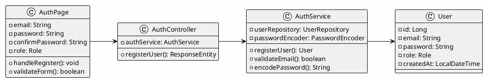

**Sequence Diagram:**
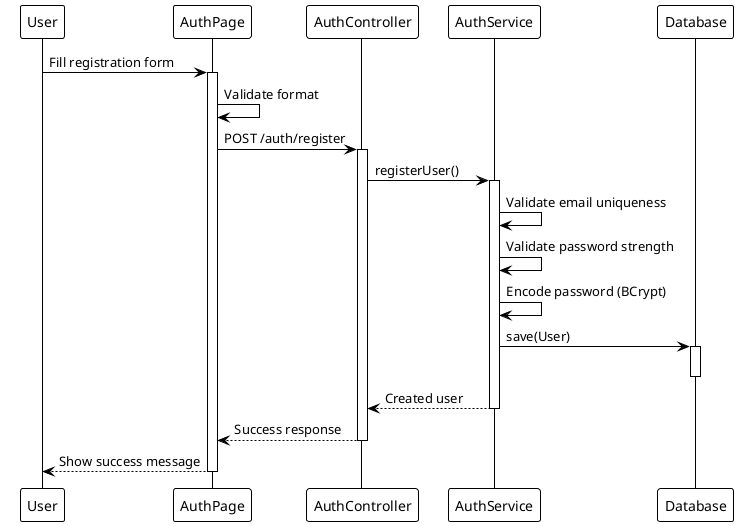

---

### Data Design

**Schema:**
```sql
CREATE TABLE users (
    id BIGINT AUTO_INCREMENT PRIMARY KEY,
    email VARCHAR(255) NOT NULL UNIQUE,
    password VARCHAR(255) NOT NULL,
    role ENUM('STUDENT', 'PROFESSOR', 'ADMIN') NOT NULL,
    status ENUM('ACTIVE', 'INACTIVE', 'LOCKED') DEFAULT 'ACTIVE',
    created_at DATETIME DEFAULT CURRENT_TIMESTAMP,
    updated_at DATETIME ON UPDATE CURRENT_TIMESTAMP,
    
    INDEX idx_email (email),
    INDEX idx_role (role)
);
```

---

## 1.2 User Login (UC 1.2)

### Front-end Component(s)

**Component Name:** `AuthPage.jsx` - Login mode

**Description and purpose:**
Login form with email and password fields. Displays error messages and manages JWT token storage.

**Component type or format:**
React Functional Component with context-based authentication state management.

---

### Back-end Component(s)

**Component Name:** `AuthController.java` - POST /auth/login

**Description and purpose:**
REST endpoint for user authentication. Validates credentials and generates JWT token.

**Component type or format:**
Spring Boot REST Controller with JWT token generation and security configuration.

---

**Component Name:** `JwtTokenProvider.java`

**Description and purpose:**
Utility class for JWT token creation, validation, and claims extraction.

**Component type or format:**
Spring Security component with JWT handling logic using jjwt library.

---

### Object-Oriented Components

**Class Diagram:**
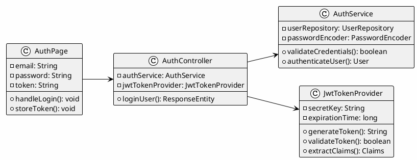

**Sequence Diagram:**
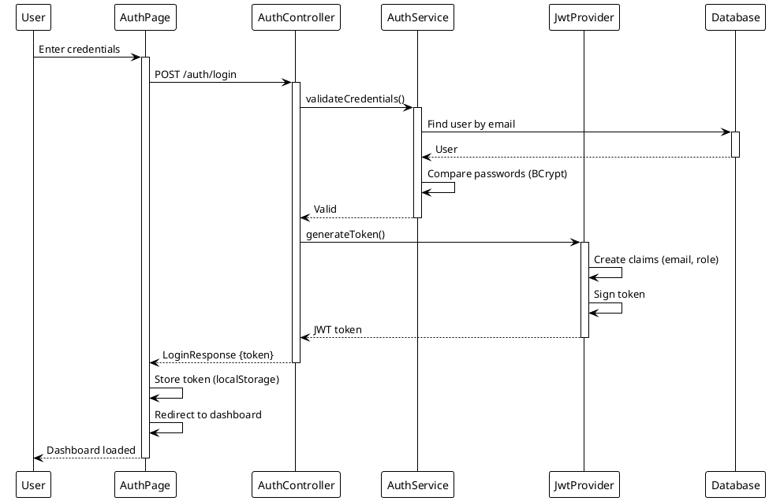

---

**Data Design:**

```sql
-- JWT stored in browser localStorage, no DB storage needed
-- Optional: Token blacklist for logout functionality
CREATE TABLE token_blacklist (
    id BIGINT AUTO_INCREMENT PRIMARY KEY,
    token_hash VARCHAR(255) UNIQUE,
    user_id BIGINT,
    blacklisted_at DATETIME DEFAULT CURRENT_TIMESTAMP,
    expires_at DATETIME,
    
    FOREIGN KEY (user_id) REFERENCES users(id) ON DELETE CASCADE,
    INDEX idx_user_id (user_id)
);
```

---

## 1.3 Password Reset (UC 1.3)

### Front-end Component(s)

**Component Name:** `ForgotPasswordPage.jsx`

**Description and purpose:**
Form for requesting password reset with email input and confirmation message. Displays success/error states.

**Component type or format:**
React Component with email validation and success/error feedback.

---

### Back-end Component(s)

**Component Name:** `AuthController.java`

**Description and purpose:**
REST endpoints for password reset flow (request reset, validate token, reset password).

**Component type or format:**
Spring Boot REST Controller with reset token generation and email service.

---

**Component Name:** `PasswordResetService.java`

**Description and purpose:**
Business logic for generating reset tokens, validating tokens, and updating passwords.

**Component type or format:**
Spring Service class with token management and email sending.

---

### Object-Oriented Components

**Class Diagram:**
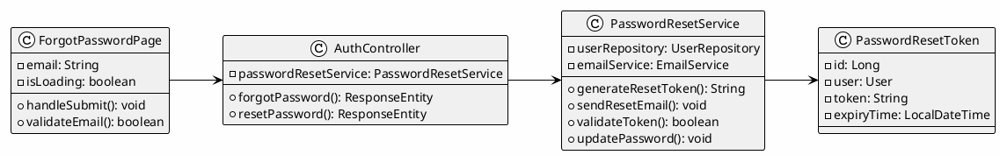

**Sequence Diagram:**
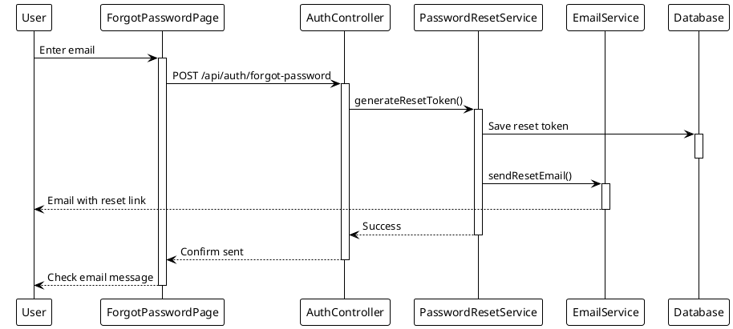

---

## 1.4 Change Password (UC 1.4)

### Front-end Component(s)

**Component Name:** `ChangePasswordPage.jsx`

**Description and purpose:**
Form for authenticated users to change their password with current password verification.

**Component type or format:**
React Component with password strength validation and confirmation.

---

### Back-end Component(s)

**Component Name:** `AuthController.java`

**Description and purpose:**
REST endpoint for authenticated users to change password.

**Component type or format:**
Spring Boot REST Controller with password verification.

---

**Component Name:** `UserService.java`

**Description and purpose:**
Service method for verifying old password and updating to new password.

**Component type or format:**
Spring Service class with password validation.

---

### Object-Oriented Components

**Class Diagram:**
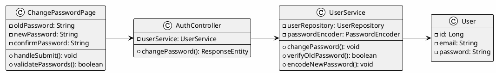

**Sequence Diagram:**
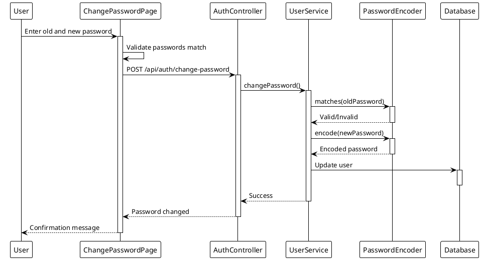

---

## 1.5 JWT Token Management (UC 1.5)

### Front-end Component(s)

**Component Name:** `AuthContext.jsx`

**Description and purpose:**
React Context for managing JWT token storage, refresh, and logout operations.

**Component type or format:**
React Context Provider with token lifecycle management.

---

### Back-end Component(s)

**Component Name:** `JwtTokenProvider.java`

**Description and purpose:**
Service for generating, validating, and refreshing JWT tokens.

**Component type or format:**
Spring Service class with JWT handling logic.

---

### Object-Oriented Components

**Class Diagram:**
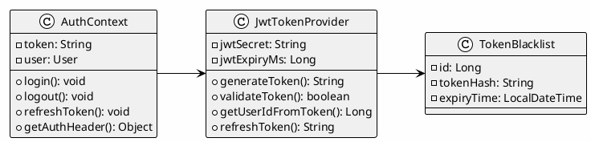

**Sequence Diagram:**
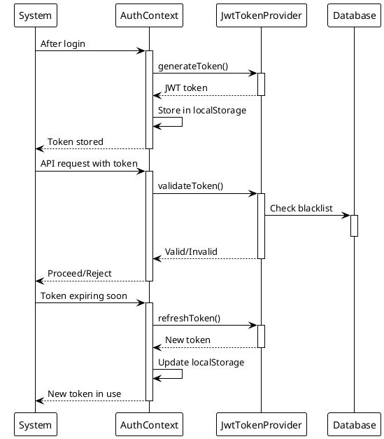

---

## 1.6 Role-Based Access Control (UC 1.6)

### Front-end Component(s)

**Component Name:** `ProtectedRoute.jsx`

**Description and purpose:**
Route wrapper component that enforces role-based access control for protected pages.

**Component type or format:**
React Component wrapper using context and conditional rendering.

---

### Back-end Component(s)

**Component Name:** `SecurityConfig.java`

**Description and purpose:**
Spring Security configuration for method-level authorization based on user roles.

**Component type or format:**
Spring Configuration class with @PreAuthorize annotations.

---

### Object-Oriented Components

**Class Diagram:**
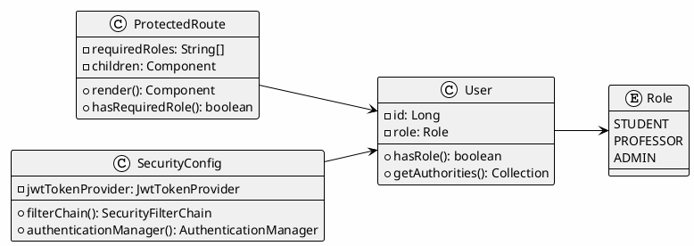

**Sequence Diagram:**
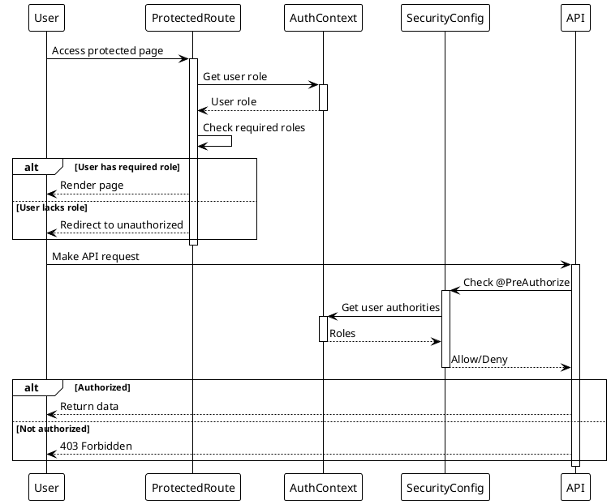

---

## 1.7 Login Attempt Logging (UC 1.7)

### Front-end Component(s)

**Component Name:** `LoginAttemptTracker.jsx` (optional admin view)

**Description and purpose:**
Optional admin component to view login attempt history.

**Component type or format:**
React Component with login attempt analytics.

---

### Back-end Component(s)

**Component Name:** `AuthController.java`

**Description and purpose:**
Enhanced with login attempt logging after each authentication request.

**Component type or format:**
Spring Boot REST Controller with audit logging.

---

**Component Name:** `AuditLogService.java`

**Description and purpose:**
Business logic for recording login attempts with success/failure status.

**Component type or format:**
Spring Service class for audit trail management.

---

### Object-Oriented Components

**Class Diagram:**
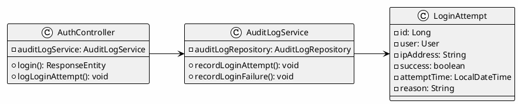

**Sequence Diagram:**
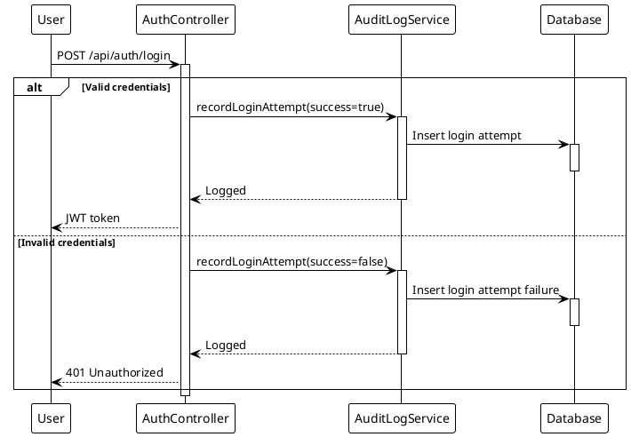

---

## 1.8 Account Lockout (UC 1.8)

### Front-end Component(s)

**Component Name:** `AuthPage.jsx` (enhanced)

**Description and purpose:**
Enhanced login page that displays account lockout message with retry timer.

**Component type or format:**
React Component with countdown timer display.

---

### Back-end Component(s)

**Component Name:** `AuthController.java`

**Description and purpose:**
Enhanced login endpoint with account lockout logic after failed attempts.

**Component type or format:**
Spring Boot REST Controller with brute-force protection.

---

**Component Name:** `AccountLockoutService.java`

**Description and purpose:**
Service for managing login attempt tracking and account lockout status.

**Component type or format:**
Spring Service class with lockout mechanism.

---

### Object-Oriented Components

**Class Diagram:**
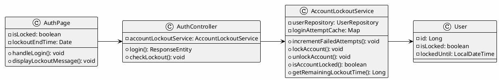

**Sequence Diagram:**
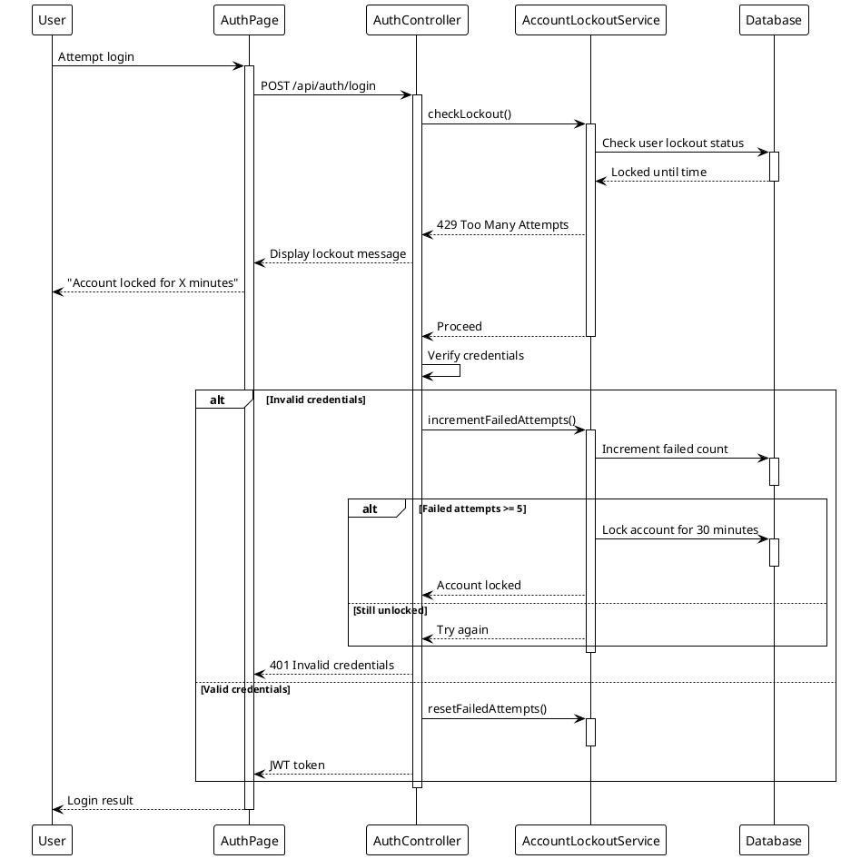

---

**Data Design:**

```sql
-- Add lockout fields to users table
ALTER TABLE users ADD COLUMN is_locked BOOLEAN DEFAULT FALSE;
ALTER TABLE users ADD COLUMN locked_until DATETIME;

-- Create login attempts tracking table
CREATE TABLE login_attempts (
    id BIGINT AUTO_INCREMENT PRIMARY KEY,
    user_id BIGINT NOT NULL,
    ip_address VARCHAR(45),
    success BOOLEAN NOT NULL,
    attempt_time DATETIME DEFAULT CURRENT_TIMESTAMP,
    failure_reason VARCHAR(255),
    
    FOREIGN KEY (user_id) REFERENCES users(id) ON DELETE CASCADE,
    INDEX idx_user_id (user_id),
    INDEX idx_attempt_time (attempt_time)
);

-- Create account lockout audit trail
CREATE TABLE account_lockouts (
    id BIGINT AUTO_INCREMENT PRIMARY KEY,
    user_id BIGINT NOT NULL,
    locked_at DATETIME DEFAULT CURRENT_TIMESTAMP,
    locked_until DATETIME NOT NULL,
    reason VARCHAR(255),
    unlocked_by BIGINT,
    unlocked_at DATETIME,
    
    FOREIGN KEY (user_id) REFERENCES users(id) ON DELETE CASCADE,
    FOREIGN KEY (unlocked_by) REFERENCES users(id) ON DELETE SET NULL,
    INDEX idx_user_id (user_id)
);
```

---