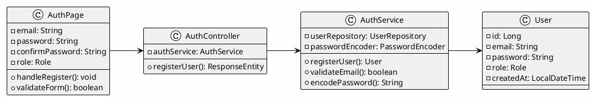
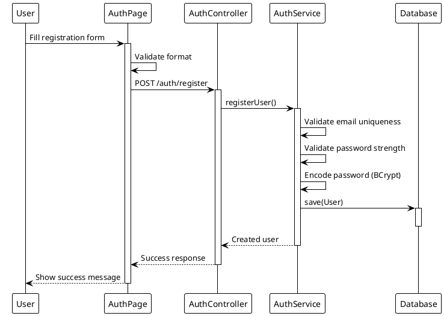
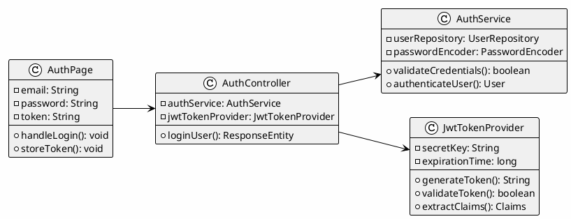
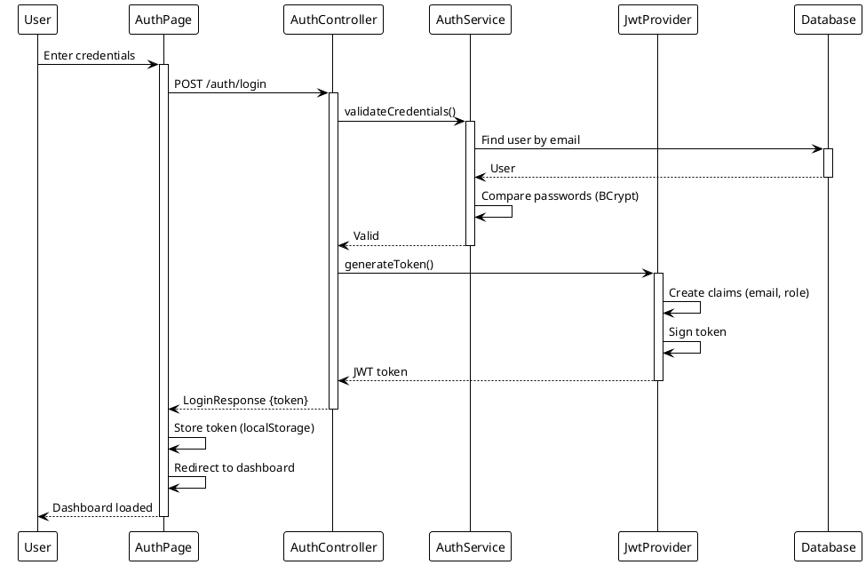

# Module 1: Basic Login and Security System

## Use Case Descriptions (UC 1.1 - 1.2)

This module documents all use cases for the SPMP Evaluator system related to **Authentication** and **Security**.

> **Legend:** ✅ = Implemented | 🔄 = In Progress | ❌ = Not Started

---

## UC 1.1: Register User

| Field | Description |
|:------|:------------|
| **Use Case Name** | Register User |
| **Primary Actor** | User (Student, Professor, Admin) |
| **Secondary Actors** | System |
| **Description** | Allow new users to create an account with **unique credentials and assigned role** (Student, Professor, or Admin). Includes password encryption behavior. |
| **Preconditions** | User has access to registration interface. System is operational. User has valid email address. Database is accessible. |
| **Postconditions** | New user account created. Password encrypted and stored securely. User credentials saved in database. User can now login to system. |

### Basic Flow ✅ ALL IMPLEMENTED

| Step | Action | Status |
|:----:|:-------|:------:|
| 1 | User navigates to registration page | ✅ |
| 2 | User enters email, password, and selects role | ✅ |
| 3 | System validates input (unique email, password strength) | ✅ |
| 4 | System encrypts password using BCrypt | ✅ |
| 5 | System stores user in database | ✅ |
| 6 | System displays success message | ✅ |

### Alternative Flows
- **Email already exists:** System displays error and prompts for different email
- **Weak password:** System displays password requirements

### Exceptions
- **Database error:** System displays error message and suggests retry

---

## UC 1.2: Login

| Field | Description |
|:------|:------------|
| **Use Case Name** | Login |
| **Primary Actor** | User (Student, Professor, Admin) |
| **Secondary Actors** | System |
| **Description** | Authenticate user credentials and **grant system access**. Includes role-based access determination and session management (JWT). |
| **Preconditions** | User has registered account. System is operational. Database is accessible. User has valid credentials. |
| **Postconditions** | User authenticated. JWT token generated and stored. Role-based permissions applied. User session established. User redirected to role-appropriate dashboard. |

### Basic Flow ✅ ALL IMPLEMENTED

| Step | Action | Status |
|:----:|:-------|:------:|
| 1 | User navigates to login page | ✅ |
| 2 | User enters email and password | ✅ |
| 3 | System validates credentials against database | ✅ |
| 4 | System generates JWT token with role claims | ✅ |
| 5 | System redirects to role-appropriate dashboard | ✅ |

### Alternative Flows
- **Invalid credentials:** System displays error message
- **Account locked:** System displays lockout message with retry time

### Exceptions
- **Authentication service unavailable:** System displays error and suggests retry

---

## Implementation Summary

| Use Case | Description | Status |
|:---------|:------------|:------:|
| UC 1.1 | Register User | ✅ Complete |
| UC 1.2 | Login | ✅ Complete |

**Total: 2/2 Use Cases Implemented (100%)**

---

# System Design Document (SDD) - Authentication & Security

## 1.1 User Registration (UC 1.1)

### Front-end Component(s)

**Component Name:** `AuthPage.jsx` - Registration mode

**Description and purpose:**
Registration form with fields for email, password, password confirmation, and role selection. Includes real-time validation and error messaging.

**Component type or format:**
React Functional Component with form validation using react-hook-form and Tailwind CSS styling.

---

### Back-end Component(s)

**Component Name:** `AuthController.java` - POST /auth/register

**Description and purpose:**
REST endpoint for user registration. Validates input, encrypts password, and creates user account.

**Component type or format:**
Spring Boot REST Controller with password encoder integration and email validation.

---

**Component Name:** `AuthService.java` - registerUser()

**Description and purpose:**
Business logic for user registration including validation, password encryption, and database persistence.

**Component type or format:**
Spring Service class with BCrypt password encoding and user entity creation.

---

### Object-Oriented Components

**Class Diagram:**


**Sequence Diagram:**


---

### Data Design

**Schema:**
```sql
CREATE TABLE users (
    id BIGINT AUTO_INCREMENT PRIMARY KEY,
    email VARCHAR(255) NOT NULL UNIQUE,
    password VARCHAR(255) NOT NULL,
    role ENUM('STUDENT', 'PROFESSOR', 'ADMIN') NOT NULL,
    status ENUM('ACTIVE', 'INACTIVE', 'LOCKED') DEFAULT 'ACTIVE',
    created_at DATETIME DEFAULT CURRENT_TIMESTAMP,
    updated_at DATETIME ON UPDATE CURRENT_TIMESTAMP,
    
    INDEX idx_email (email),
    INDEX idx_role (role)
);
```

---

## 1.2 User Login (UC 1.2)

### Front-end Component(s)

**Component Name:** `AuthPage.jsx` - Login mode

**Description and purpose:**
Login form with email and password fields. Displays error messages and manages JWT token storage.

**Component type or format:**
React Functional Component with context-based authentication state management.

---

### Back-end Component(s)

**Component Name:** `AuthController.java` - POST /auth/login

**Description and purpose:**
REST endpoint for user authentication. Validates credentials and generates JWT token.

**Component type or format:**
Spring Boot REST Controller with JWT token generation and security configuration.

---

**Component Name:** `JwtTokenProvider.java`

**Description and purpose:**
Utility class for JWT token creation, validation, and claims extraction.

**Component type or format:**
Spring Security component with JWT handling logic using jjwt library.

---

### Object-Oriented Components

**Class Diagram:**


**Sequence Diagram:**


---

**Data Design:**

```sql
-- JWT stored in browser localStorage, no DB storage needed
-- Optional: Token blacklist for logout functionality
CREATE TABLE token_blacklist (
    id BIGINT AUTO_INCREMENT PRIMARY KEY,
    token_hash VARCHAR(255) UNIQUE,
    user_id BIGINT,
    blacklisted_at DATETIME DEFAULT CURRENT_TIMESTAMP,
    expires_at DATETIME,
    
    FOREIGN KEY (user_id) REFERENCES users(id) ON DELETE CASCADE,
    INDEX idx_user_id (user_id)
);
```

---