# Module 2: Role-Based User Interface Transactions

## Use Case Descriptions (UC 2.1 - 2.10)

This module documents all use cases for the SPMP Evaluator system related to **Student** and **Professor** roles.

> **Legend:** ✅ = Implemented | 🔄 = In Progress | ❌ = Not Started

---

## UC 2.1: Student File Upload

| Field | Description |
|:------|:------------|
| **Use Case Name** | Student File Upload |
| **Primary Actor** | Student |
| **Secondary Actors** | None |
| **Description** | Enables students to upload project-related files (**SPMP documents**) to the system for evaluation and feedback. |
| **Preconditions** | Student is logged in and has a valid SPMP document ready for upload. |
| **Postconditions** | File is stored in the system and available for evaluation. |

### Basic Flow ✅ ALL IMPLEMENTED

| Step | Action | Status |
|:----:|:-------|:------:|
| 1 | Student navigates to the upload section | ✅ |
| 2 | Student selects the file to upload | ✅ |
| 3 | System validates file format and size | ✅ |
| 4 | Student confirms upload | ✅ |
| 5 | System processes and stores the file | ✅ |
| 6 | System displays upload confirmation | ✅ |

### Alternative Flows
- **Invalid file format:** System displays error message and prompts for correct format
- **File too large:** System rejects upload and suggests compression

---

## UC 2.2: Student File Edit

| Field | Description |
|:------|:------------|
| **Use Case Name** | Student File Edit |
| **Primary Actor** | Student |
| **Secondary Actors** | None |
| **Description** | Allows students to **replace or update previously uploaded project files** before evaluation deadlines. |
| **Preconditions** | Student is logged in and has previously uploaded a file that can still be edited. |
| **Postconditions** | Updated file replaces the original and is queued for re-evaluation. |

### Basic Flow ✅ ALL IMPLEMENTED

| Step | Action | Status |
|:----:|:-------|:------:|
| 1 | Student views list of uploaded files | ✅ |
| 2 | Student selects a file to edit | ✅ |
| 3 | Student uploads replacement file | ✅ |
| 4 | System validates new file | ✅ |
| 5 | Student confirms changes | ✅ |
| 6 | System updates file and logs change | ✅ |

### Alternative Flows
- **File past deadline:** System prevents edit and shows deadline notice

### Exceptions
- **Validation failure:** System retains original file and prompts for corrections

---

## UC 2.3: Student File Removal

| Field | Description |
|:------|:------------|
| **Use Case Name** | Student File Removal |
| **Primary Actor** | Student |
| **Secondary Actors** | None |
| **Description** | Enables students to **delete their uploaded files** if they are before the submission deadline. |
| **Preconditions** | Student is logged in and has uploaded files that are still within the removal window. |
| **Postconditions** | File is permanently deleted from the system. |

### Basic Flow ✅ ALL IMPLEMENTED

| Step | Action | Status |
|:----:|:-------|:------:|
| 1 | Student views list of uploaded files | ✅ |
| 2 | Student selects a file for removal | ✅ |
| 3 | System prompts for confirmation | ✅ |
| 4 | Student confirms deletion | ✅ |
| 5 | System removes file and logs action | ✅ |

### Alternative Flows
- **File past deadline:** System disables removal option

### Exceptions
- **Deletion failure:** System retains file and shows error message

---

## UC 2.4: Student View Feedback

| Field | Description |
|:------|:------------|
| **Use Case Name** | Student View Feedback |
| **Primary Actor** | Student |
| **Secondary Actors** | Professor (indirect, provides feedback) |
| **Description** | Students can **access detailed feedback, comments, and grades** provided by professors on their uploaded files. |
| **Preconditions** | Student is logged in and has uploaded files that have been evaluated. |
| **Postconditions** | Students can access detailed feedback, comments, and grades provided by professors. |

### Basic Flow ✅ ALL IMPLEMENTED

| Step | Action | Status |
|:----:|:-------|:------:|
| 1 | Student navigates to feedback section | ✅ |
| 2 | Student selects a specific file | ✅ |
| 3 | System displays evaluation results | ✅ |
| 4 | Student reviews comments and scores | ✅ |
| 5 | System tracks view activity | ✅ |

### Alternative Flows
- **No evaluation yet:** System shows "Pending evaluation" status

### Exceptions
- **System error:** Display error message and suggest retry

---

## UC 2.5: Student Task Tracking

| Field | Description |
|:------|:------------|
| **Use Case Name** | Student Task Tracking |
| **Primary Actor** | Student |
| **Secondary Actor** | Professor (assigns tasks) |
| **Description** | Students can **view tasks assigned to them**, including deadlines, progress, and completion status. |
| **Preconditions** | Student is logged in. Tasks have been assigned by a Professor. |
| **Postconditions** | Student is aware of current task status and deadlines. |

### Basic Flow ✅ ALL IMPLEMENTED

| Step | Action | Status |
|:----:|:-------|:------:|
| 1 | Student accesses task tracking section | ✅ |
| 2 | System displays list of assigned tasks | ✅ |
| 3 | Student views task details and deadlines | ✅ |
| 4 | Student checks progress indicators | ✅ |
| 5 | System updates view activity | ✅ |

### Alternative Flows
- **No tasks assigned:** System shows empty state with helpful message

### Exceptions
- **System unavailable:** Show cached tasks or offline message

---

## UC 2.6: Professor Task Creation

| Field | Description |
|:------|:------------|
| **Use Case Name** | Professor Task Creation |
| **Primary Actor** | Professor |
| **Secondary Actor** | None |
| **Description** | Professors can **create new project tasks for students**, including descriptions, deadlines, and requirements. |
| **Preconditions** | Professor is logged in and has permission to create tasks. |
| **Postconditions** | Task is created and students are notified. |

### Basic Flow ✅ ALL IMPLEMENTED

| Step | Action | Status |
|:----:|:-------|:------:|
| 1 | Professor navigates to task creation | ✅ |
| 2 | Professor enters task details | ✅ |
| 3 | Professor sets deadline and requirements | ✅ |
| 4 | Professor assigns to specific students/groups | ✅ |
| 5 | System saves task and notifies students | ✅ |

### Alternative Flows
- **Save as draft:** Task is saved but not published yet

### Exceptions
- **Validation error:** System highlights issues and prevents saving

---

## UC 2.7: Professor Supplement Grading Criteria

| Field | Description |
|:------|:------------|
| **Use Case Name** | Professor Supplement Grading Criteria |
| **Primary Actor** | Professor |
| **Secondary Actor** | None |
| **Description** | Professors can **supplement AI-generated evaluations with custom grading rubrics and criteria**. |
| **Preconditions** | Professor is logged in and has access to grading tools. |
| **Postconditions** | Custom grading criteria are saved and applied to future student evaluations. |

### Basic Flow ✅ ALL IMPLEMENTED

| Step | Action | Status |
|:----:|:-------|:------:|
| 1 | Professor selects evaluation criteria section | ✅ |
| 2 | Professor defines custom criteria | ✅ |
| 3 | Professor sets weightings for each criterion | ✅ |
| 4 | Professor saves criteria for use in evaluations | ✅ |
| 5 | System applies to future evaluations | ✅ |

### Alternative Flows
- **Load template:** Use pre-defined criteria templates

### Exceptions
- **System validation failure:** Criteria are reset, and error message is displayed

---

## UC 2.8: Professor Override AI Results

| Field | Description |
|:------|:------------|
| **Use Case Name** | Professor Override AI Results |
| **Primary Actor** | Professor |
| **Secondary Actors** | None |
| **Description** | Professors can review AI-generated evaluations and **manually override scores or feedback** if necessary. |
| **Preconditions** | AI evaluation has been completed for a student's submission. |
| **Postconditions** | Overridden results are final and logged for auditing. |

### Basic Flow ✅ ALL IMPLEMENTED

| Step | Action | Status |
|:----:|:-------|:------:|
| 1 | Professor views AI evaluation results | ✅ |
| 2 | Professor reviews scores and feedback | ✅ |
| 3 | Professor makes manual adjustments | ✅ |
| 4 | Professor adds justification for override | ✅ |
| 5 | System saves override and notifies student | ✅ |

### Alternative Flows
- **Accept AI results:** No changes needed, just confirm

### Exceptions
- **Permission denied:** Ensure professor has rights for specific student

---

## UC 2.9: Professor Update Tasks

| Field | Description |
|:------|:------------|
| **Use Case Name** | Professor Update Tasks |
| **Primary Actor** | Professor |
| **Secondary Actor** | Students (affected by changes) |
| **Description** | Professors can **modify existing task instructions, deadlines, or requirements** as needed. |
| **Preconditions** | Task exists and professor has edit permissions. |
| **Postconditions** | Task is updated and students are informed of changes. |

### Basic Flow ✅ ALL IMPLEMENTED

| Step | Action | Status |
|:----:|:-------|:------:|
| 1 | Professor selects task to edit | ✅ |
| 2 | Professor modifies instructions/deadlines | ✅ |
| 3 | System validates changes | ✅ |
| 4 | Professor confirms updates | ✅ |
| 5 | System saves and notifies affected students | ✅ |

### Alternative Flows
- **Extend deadline:** Automatically notify students of extension

### Exceptions
- **Invalid deadline:** Prevent setting past dates or invalid times

---

## UC 2.10: Professor Monitor Student Progress

| Field | Description |
|:------|:------------|
| **Use Case Name** | Professor Monitor Student Progress |
| **Primary Actor** | Professor |
| **Secondary Actors** | None |
| **Description** | Professors can **track student submission status, review evaluation scores, and monitor overall class performance trends**. |
| **Preconditions** | Professor is logged in and students have submitted files for evaluation. |
| **Postconditions** | Professor has a comprehensive overview of class progress. |

### Basic Flow ✅ ALL IMPLEMENTED

| Step | Action | Status |
|:----:|:-------|:------:|
| 1 | Professor navigates to the progress dashboard | ✅ |
| 2 | System displays a class-wide summary | ✅ |
| 3 | Professor filters by student or group | ✅ |
| 4 | Professor reviews individual submission status and scores | ✅ |
| 5 | System logs viewing activity | ✅ |

### Alternative Flows
- **Export data:** Professor downloads summary data in CSV format

### Exceptions
- **Data retrieval failure:** System displays offline or error message

---

## Implementation Summary

| Use Case | Description | Status |
|:---------|:------------|:------:|
| UC 2.1 | Student File Upload | ✅ Complete |
| UC 2.2 | Student File Edit | ✅ Complete |
| UC 2.3 | Student File Removal | ✅ Complete |
| UC 2.4 | Student View Feedback | ✅ Complete |
| UC 2.5 | Student Task Tracking | ✅ Complete |
| UC 2.6 | Professor Task Creation | ✅ Complete |
| UC 2.7 | Professor Supplement Grading Criteria | ✅ Complete |
| UC 2.8 | Professor Override AI Results | ✅ Complete |
| UC 2.9 | Professor Update Tasks | ✅ Complete |
| UC 2.10 | Professor Monitor Student Progress | ✅ Complete |
| UC 2.11 | Admin User Management | ✅ Complete |
| UC 2.12 | Admin Assign Students to Professors | ✅ Complete |
| UC 2.13 | Admin View Audit Logs | ✅ Complete |
| UC 2.14 | Admin System Reports | ✅ Complete |
| UC 2.15 | Admin System Settings | ✅ Complete |

**Total: 15/15 Use Cases Implemented (100%)**

---

## UC 2.11: Admin User Management

| Field | Description |
|:------|:------------|
| **Use Case Name** | Admin User Management |
| **Primary Actor** | Admin |
| **Secondary Actors** | None |
| **Description** | Admins can **create, view, update, and delete user accounts** (professors and students), including resetting passwords and managing user roles. |
| **Preconditions** | Admin is logged in and has admin privileges. |
| **Postconditions** | User accounts are created, updated, or deleted, and all changes are logged for auditing. |

### Basic Flow ✅ ALL IMPLEMENTED

| Step | Action | Status |
|:----:|:-------|:------:|
| 1 | Admin navigates to user management section | ✅ |
| 2 | Admin selects action (create, view, edit, delete) | ✅ |
| 3 | System displays user list or creation form | ✅ |
| 4 | Admin enters or modifies user information | ✅ |
| 5 | System validates input data | ✅ |
| 6 | Admin confirms changes | ✅ |
| 7 | System saves changes and logs action | ✅ |
| 8 | System sends notification to affected user | ✅ |

### Alternative Flows
- **Reset password:** Admin can generate and send password reset link to user
- **Lock/unlock account:** Admin can temporarily disable or enable user accounts
- **Bulk import:** Admin can upload CSV file to create multiple users

### Exceptions
- **Duplicate email:** System prevents creation of users with existing email
- **Invalid role:** System rejects invalid role assignments

---

## UC 2.12: Admin Assign Students to Professors

| Field | Description |
|:------|:------------|
| **Use Case Name** | Admin Assign Students to Professors |
| **Primary Actor** | Admin |
| **Secondary Actors** | Professors, Students (notified) |
| **Description** | Admins can **assign students to professors** for supervision and evaluation, managing the student-professor relationships in the system. |
| **Preconditions** | Admin is logged in, and both students and professors exist in the system. |
| **Postconditions** | Students are assigned to professors, and both parties are notified of the assignment. |

### Basic Flow ✅ ALL IMPLEMENTED

| Step | Action | Status |
|:----:|:-------|:------:|
| 1 | Admin navigates to student assignment section | ✅ |
| 2 | Admin selects professor from list | ✅ |
| 3 | System displays available students | ✅ |
| 4 | Admin selects one or multiple students | ✅ |
| 5 | Admin confirms assignment | ✅ |
| 6 | System creates assignment relationships | ✅ |
| 7 | System sends notifications to professor and students | ✅ |
| 8 | System logs assignment action | ✅ |

### Alternative Flows
- **Reassign student:** Admin can change student's assigned professor
- **Bulk assignment:** Admin can assign multiple students to one professor at once
- **Remove assignment:** Admin can unassign students from professors

### Exceptions
- **Student already assigned:** System warns before reassigning
- **Professor at capacity:** System warns if professor has too many students

---

## UC 2.13: Admin View Audit Logs

| Field | Description |
|:------|:------------|
| **Use Case Name** | Admin View Audit Logs |
| **Primary Actor** | Admin |
| **Secondary Actors** | None |
| **Description** | Admins can **view comprehensive audit logs** of all system activities, including user actions, document uploads, evaluations, and administrative changes. |
| **Preconditions** | Admin is logged in and has audit log access permissions. |
| **Postconditions** | Admin has visibility into system activity and can identify security issues or anomalies. |

### Basic Flow ✅ ALL IMPLEMENTED

| Step | Action | Status |
|:----:|:-------|:------:|
| 1 | Admin navigates to audit log section | ✅ |
| 2 | System displays paginated log entries | ✅ |
| 3 | Admin applies filters (user, date, action type) | ✅ |
| 4 | System updates display with filtered results | ✅ |
| 5 | Admin reviews log details | ✅ |
| 6 | Admin exports logs if needed | ✅ |

### Alternative Flows
- **Search by user:** Admin can filter logs by specific user
- **Search by date range:** Admin can view logs within specific time period
- **Export to CSV:** Admin can download logs for external analysis

### Exceptions
- **No logs found:** System displays message when no logs match criteria
- **Export size too large:** System prompts admin to narrow date range

---

## UC 2.14: Admin System Reports

| Field | Description |
|:------|:------------|
| **Use Case Name** | Admin System Reports |
| **Primary Actor** | Admin |
| **Secondary Actors** | None |
| **Description** | Admins can **generate comprehensive system reports** including user statistics, document submission trends, evaluation metrics, and system usage analytics. |
| **Preconditions** | Admin is logged in and system has sufficient data for reporting. |
| **Postconditions** | Reports are generated and can be viewed or exported for stakeholder review. |

### Basic Flow ✅ ALL IMPLEMENTED

| Step | Action | Status |
|:----:|:-------|:------:|
| 1 | Admin navigates to reports section | ✅ |
| 2 | Admin selects report type | ✅ |
| 3 | Admin sets parameters (date range, filters) | ✅ |
| 4 | System generates report | ✅ |
| 5 | System displays report with visualizations | ✅ |
| 6 | Admin reviews report data | ✅ |
| 7 | Admin exports report (PDF/Excel) if needed | ✅ |

### Alternative Flows
- **Scheduled reports:** Admin can schedule automatic report generation
- **Custom reports:** Admin can create custom report templates
- **Dashboard view:** Admin can pin important metrics to dashboard

### Exceptions
- **Insufficient data:** System warns when data is too limited for meaningful report
- **Report generation timeout:** System provides option to run report asynchronously

---

## UC 2.15: Admin System Settings

| Field | Description |
|:------|:------------|
| **Use Case Name** | Admin System Settings |
| **Primary Actor** | Admin |
| **Secondary Actors** | None |
| **Description** | Admins can **configure system-wide settings** including registration controls, evaluation parameters, notification settings, and system maintenance modes. |
| **Preconditions** | Admin is logged in and has system configuration permissions. |
| **Postconditions** | System settings are updated and take effect immediately or as scheduled. |

### Basic Flow ✅ ALL IMPLEMENTED

| Step | Action | Status |
|:----:|:-------|:------:|
| 1 | Admin navigates to system settings | ✅ |
| 2 | Admin selects settings category | ✅ |
| 3 | System displays current configuration | ✅ |
| 4 | Admin modifies settings | ✅ |
| 5 | System validates new settings | ✅ |
| 6 | Admin confirms changes | ✅ |
| 7 | System applies settings and logs change | ✅ |
| 8 | System notifies users if settings affect them | ✅ |

### Alternative Flows
- **Maintenance mode:** Admin can enable system maintenance mode
- **Registration controls:** Admin can open/close student/professor registration
- **Feature toggles:** Admin can enable/disable specific system features

### Exceptions
- **Invalid configuration:** System prevents saving invalid settings
- **Requires restart:** System warns when changes require application restart

---

# 2.3 Admin: System Administration & User Management

## Overview
This section documents all administrative use cases (UC 2.11 - UC 2.15) for system administrators managing users, assignments, and audit activities.

---

## Activity Diagrams

### Activity Diagram 1: Admin Create User

```
[Start]
↓
Admin opens Dashboard
↓
Admin clicks "Create User"
↓
Admin fills User Form (Name, Email, Role)
↓
System validates user data
↓
Decision:
  - If invalid → Show validation error message
  - If valid → System creates user account → System logs action → User Created
↓
[End]
```

### Activity Diagram 2: Admin Edit User

```
[Start]
↓
Admin opens User Management
↓
Admin selects user from list
↓
Admin modifies user details (Name, Email, Role, Status)
↓
System validates changes
↓
Decision:
  - If invalid → Show validation error
  - If valid → System updates user record → System logs action → User Updated
↓
[End]
```

### Activity Diagram 3: Admin Delete User

```
[Start]
↓
Admin opens User Management
↓
Admin selects user to delete
↓
System prompts confirmation dialog
↓
Decision:
  - If cancel → Return to user list
  - If confirm → System cascade-deletes user data → System logs deletion → User Deleted
↓
[End]
```

### Activity Diagram 4: Admin View Audit Log

```
[Start]
↓
Admin navigates to Audit Log section
↓
System displays paginated log entries
↓
Admin applies filters (Date, User, Action Type)
↓
System updates display with filtered results
↓
Decision:
  - Export logs → System generates CSV/PDF → Download complete
  - View details → System displays detailed log entry → Admin reviews
↓
[End]
```

### Activity Diagram 5: Admin System Settings
```

---

## UC 2.11: Admin View & Manage Users

| Field | Description |
|:------|:------------|
| **Use Case Name** | Admin View & Manage Users |
| **Primary Actor** | Administrator |
| **Secondary Actors** | Database, User Management Module |
| **Description** | Allows administrators to **view a list of all users** in the system, including students, professors, and other admins, with filtering and search capabilities. |
| **Preconditions** | Administrator is logged in and has admin privileges. |
| **Postconditions** | Admin can view, search, and filter the complete user list. |

### Basic Flow ✅ ALL IMPLEMENTED

| Step | Action | Status |
|:----:|:-------|:------:|
| 1 | Admin navigates to User Management section | ✅ |
| 2 | System displays all users with role, email, and status | ✅ |
| 3 | Admin can filter by role (Student/Professor/Admin) | ✅ |
| 4 | Admin can search by name or email | ✅ |
| 5 | Admin can sort by date created, last login, or status | ✅ |
| 6 | System displays user details on selection | ✅ |

### Alternative Flows
- **No users found:** System displays "No users matching criteria" message
- **Export list:** Admin can export user list as CSV

### Exceptions
- **Database error:** System displays error message and retry option

---

## UC 2.12: Admin Create User

| Field | Description |
|:------|:------------|
| **Use Case Name** | Admin Create User |
| **Primary Actor** | Administrator |
| **Secondary Actors** | Database, Email Service |
| **Description** | Enables administrators to **create new user accounts** directly in the system with assigned role (Student, Professor, Admin). |
| **Preconditions** | Administrator is logged in with admin privileges. |
| **Postconditions** | New user account is created and stored in the database. |

### Basic Flow ✅ ALL IMPLEMENTED

| Step | Action | Status |
|:----:|:-------|:------:|
| 1 | Admin opens Create User form | ✅ |
| 2 | Admin enters name, email, role | ✅ |
| 3 | System validates email format and uniqueness | ✅ |
| 4 | Admin sets temporary password or auto-generates one | ✅ |
| 5 | Admin confirms user creation | ✅ |
| 6 | System creates user account and logs action | ✅ |

### Alternative Flows
- **Email already exists:** System displays error and suggests recovery or alternative email
- **Auto-send credentials:** Admin can send temporary password via email

### Exceptions
- **Invalid input:** System shows validation error and prompts correction
- **Database error:** System prevents creation and displays error message

---

## UC 2.13: Admin Edit User

| Field | Description |
|:------|:------------|
| **Use Case Name** | Admin Edit User |
| **Primary Actor** | Administrator |
| **Secondary Actors** | Database |
| **Description** | Allows administrators to **modify user details** such as name, email, role, and status. |
| **Preconditions** | Administrator is logged in and user to be edited exists. |
| **Postconditions** | User details are updated in the database and changes are logged. |

### Basic Flow ✅ ALL IMPLEMENTED

| Step | Action | Status |
|:----:|:-------|:------:|
| 1 | Admin selects a user from the user list | ✅ |
| 2 | Admin opens user edit form | ✅ |
| 3 | Admin modifies user details (name, email, role, status) | ✅ |
| 4 | System validates changes | ✅ |
| 5 | Admin confirms changes | ✅ |
| 6 | System updates user record and logs action | ✅ |

### Alternative Flows
- **Change role:** Admin can change user role (e.g., Student → Professor)
- **Disable account:** Admin can disable/enable user account without deletion

### Exceptions
- **Email conflict:** System prevents duplicate email and prompts alternative
- **Invalid data:** System shows validation error and retains original values

---

## UC 2.14: Admin Delete User

| Field | Description |
|:------|:------------|
| **Use Case Name** | Admin Delete User |
| **Primary Actor** | Administrator |
| **Secondary Actors** | Database |
| **Description** | Enables administrators to **remove user accounts** from the system and cascade-delete associated assignments and tasks. |
| **Preconditions** | Administrator is logged in and user to be deleted exists. |
| **Postconditions** | User account and all associated data (assignments, tasks) are removed from the system. |

### Basic Flow ✅ ALL IMPLEMENTED

| Step | Action | Status |
|:----:|:-------|:------:|
| 1 | Admin selects user to delete | ✅ |
| 2 | System prompts for confirmation | ✅ |
| 3 | Admin confirms deletion | ✅ |
| 4 | System cascade-deletes user, assignments, and tasks | ✅ |
| 5 | System logs deletion action | ✅ |
| 6 | System displays success message | ✅ |

### Alternative Flows
- **Soft delete:** System can archive user instead of permanent deletion
- **Audit trail:** Deleted user data is preserved in audit log

### Exceptions
- **User not found:** System displays error and updates list
- **Deletion failure:** System retains user and displays error message

---

## UC 2.15: Admin View Audit Log

| Field | Description |
|:------|:------------|
| **Use Case Name** | Admin View Audit Log |
| **Primary Actor** | Administrator |
| **Secondary Actors** | Database, Audit Log Module |
| **Description** | Allows administrators to **access comprehensive audit logs** of all system activities, including user actions, file uploads, deletions, and system changes. |
| **Preconditions** | Administrator is logged in with admin privileges. |
| **Postconditions** | Admin can view, filter, and export audit logs for compliance and security analysis. |

### Basic Flow ✅ ALL IMPLEMENTED

| Step | Action | Status |
|:----:|:----:|:------:|
| 1 | Admin navigates to Audit Log section | ✅ |
| 2 | System displays all logged activities with timestamp, user, action | ✅ |
| 3 | Admin can filter by date range | ✅ |
| 4 | Admin can filter by user or action type | ✅ |
| 5 | Admin can view detailed log entry | ✅ |
| 6 | Admin can export logs as CSV or PDF | ✅ |

### Alternative Flows
- **Advanced search:** Admin can search by keyword or action code
- **Real-time monitoring:** Admin can view live system activity stream
- **Alert setup:** Admin can configure alerts for specific activities

### Exceptions
- **No logs found:** System displays "No logs matching criteria" message
- **Export error:** System shows error and suggests retry

---

## Admin Role Summary

| Feature | Status | API Endpoint | Frontend Component |
|---------|--------|--------------|-------------------|
| View Users | ✅ DONE | `GET /api/admin/users` | `UserManagement.jsx` |
| Create User | ✅ DONE | `POST /api/admin/users` | `UserManagement.jsx` |
| Edit User | ✅ DONE | `PUT /api/admin/users/{id}` | `UserManagement.jsx` |
| Delete User | ✅ DONE | `DELETE /api/admin/users/{id}` | `UserManagement.jsx` |
| Assign Students | ✅ DONE | `POST /api/admin/assignments` | `StudentAssignmentForm.jsx` |
| View Audit Log | ✅ DONE | `GET /api/admin/audit-logs` | `AuditLogViewer.jsx` |
| System Reports | ✅ DONE | `GET /api/admin/reports/*` | `AdminReports.jsx` |
| System Settings | ✅ DONE | `GET/POST /api/admin/settings` | `SystemSettingsForm.jsx` |

**All 5 Admin Features (UC 2.11-2.15) Fully Implemented: Backend + Frontend + Database**

---

# 2.3 System Administrator (SRS Format)

## Use Case Diagram

**Actors:**
- System Administrator

**Use Cases:**
- Manage Users (Create/Edit/Delete)
- View User List
- View Audit Log

**Relationships:**
- Administrator → View User List
- Administrator → Manage Users (Create/Edit/Delete)
- Administrator → View Audit Log
- Manage Users → includes View User List

**System Boundary:**
- Admin Dashboard Module

---

## Use Case Description

| Section | Details |
|---------|---------|
| **Use Case ID** | UC 2.3 |
| **Use Case Name** | System Administrator Dashboard & User Management |
| **Primary Actors** | System Administrator |
| **Secondary Actor(s)** | Database, User Management Module, Audit Log Module, Email Service |
| **Description** | The administrator can:<br/>• View all users in the system with filtering and search<br/>• Create, edit, and delete user accounts<br/>• Assign roles to users (Student, Professor, Admin)<br/>• View comprehensive audit logs of all system activities<br/>• Monitor user compliance and system security |
| **Preconditions** | Administrator is logged in with admin privileges. User list is loaded. |
| **Postconditions** | User management actions are saved and logged. Audit trail is maintained. |

---

## Basic Flow

### A. User Management (View/Create/Edit/Delete)

1. Administrator opens the Admin Dashboard
2. System displays all users with:
   - User name & email
   - Role (Student/Professor/Admin)
   - Status (Active/Inactive)
   - Date Created
   - Last Login

3. Administrator can:
   - **Filter by role:** Select Student, Professor, or Admin
   - **Search by name/email:** Enter keyword to find users
   - **Sort by:** Date Created, Last Login, or Status
   - **Create User:** Click "Add User" button
   - **Edit User:** Click user row to edit details
   - **Delete User:** Select user and click "Delete" (with confirmation)

4. **Create User Flow:**
   - Administrator clicks "Create User"
   - System opens User Form with fields:
     - Full Name (required)
     - Email (required, must be unique)
     - Role (Student/Professor/Admin)
     - Temporary Password (auto-generated or custom)
   - Administrator fills form and clicks "Create"
   - System validates email uniqueness
   - System creates user account and logs action
   - System displays success message

5. **Edit User Flow:**
   - Administrator selects user from list
   - System opens Edit Form with current details
   - Administrator modifies name, email, role, or status
   - System validates changes (e.g., email uniqueness)
   - Administrator clicks "Save"
   - System updates user record and logs action
   - System displays success message

6. **Delete User Flow:**
   - Administrator selects user from list
   - System prompts confirmation: "This will delete user and all associated data"
   - Administrator confirms
   - System cascade-deletes user, tasks, and assignments
   - System logs deletion action
   - System displays success message and refreshes user list

### B. Audit Log Viewing

1. Administrator opens Audit Log section
2. System displays all logged activities with:
   - Timestamp
   - User who performed action
   - Action type (Create/Edit/Delete/Login/etc.)
   - Resource affected
   - Details

3. Administrator can:
   - **Filter by date range:** Select start and end date
   - **Filter by user:** Select specific user to view their actions
   - **Filter by action type:** Select Create, Edit, Delete, Login, etc.
   - **Search:** Enter keyword or action code
   - **View details:** Click log entry to see full details
   - **Export logs:** Download as CSV or PDF

4. System displays activities such as:
   - User Login attempts (success/failure)
   - User Account created/edited/deleted
   - Document uploaded/deleted
   - Feedback provided
   - Tasks assigned/completed
   - System settings changed

---

### Alternative Flows

| Scenario | Flow |
|----------|------|
| **Email already exists** | System prevents creation with error: "Email already in use". Admin can recover account or use different email. |
| **Role change request** | Admin can change user role (Student → Professor, etc.). System notifies user of role change. |
| **Account disable** | Admin can disable user account without deletion. Disabled users cannot log in but data is preserved. |
| **Bulk user creation** | Admin can import users via CSV file (name, email, role). System validates and creates accounts. |
| **Export user list** | Admin can export all users or filtered results as CSV. |
| **Real-time activity** | Admin can view live system activity stream for monitoring. |
| **No audit logs found** | System displays "No logs matching criteria" message. |

---

### Exceptions

| Exception | Resolution |
|-----------|-----------|
| **Database error** | System displays error message and provides retry option. |
| **Invalid input** | System shows validation error (e.g., "Email format invalid") and prompts correction. |
| **Duplicate email** | System prevents duplicate email and suggests recovery or alternative. |
| **User not found** | System updates list and displays "User not found" message. |
| **Deletion failure** | System retains user account and displays error message. |
| **Export error** | System shows error and suggests retry or alternative format. |
| **Requires restart** | System warns if settings changes require application restart. |
| **Export error** | System shows error and suggests retry or alternative format. |
| **Requires restart** | System warns if settings changes require application restart. |

---

---

# System Design Document (SDD) - Role-Based Components

## Format: Detailed Design per Transaction

---

# Module 2 - SDD

## 2.1 Student File Upload (UC 2.1)

### Front-end Component(s)

**Component Name:** `DocumentUpload.jsx`

**Description and purpose:** 
Drag-and-drop file upload interface with real-time format validation (PDF/DOCX only) and file size verification (maximum 50MB). Displays upload progress, success/error messages, and file metadata.

**Component type or format:** 
React Functional Component with hooks (useState, useRef, useEffect). Manages file state, upload status, and error handling. Uses Tailwind CSS for styling and integrates with apiService for backend communication.

---

### Back-end Component(s)

**Component Name:** `DocumentController.java`

**Description and purpose:** 
REST API controller handling document upload endpoints. Manages file upload requests, delegates business logic to DocumentService, and returns response with uploaded document metadata.

**Component type or format:** 
Spring Boot REST Controller with `@PostMapping` endpoints. Implements multipart file handling, validation, and error responses. Enforces role-based access control (@PreAuthorize).

---

**Component Name:** `SPMPDocumentService.java`

**Description and purpose:** 
Business logic layer for document processing. Validates file format/size, stores files in filesystem (uploads/documents/), creates SPMPDocument entity, and triggers AI evaluation via OpenRouterService.

**Component type or format:** 
Spring Service class with business logic methods. Uses DocumentRepository for database operations, OpenRouterService for AI analysis, and FileUtil for file operations.

---

### Object-Oriented Components

**Class Diagram:**
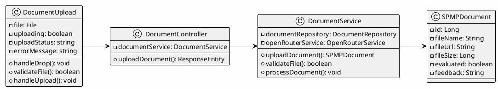

**Sequence Diagram:**
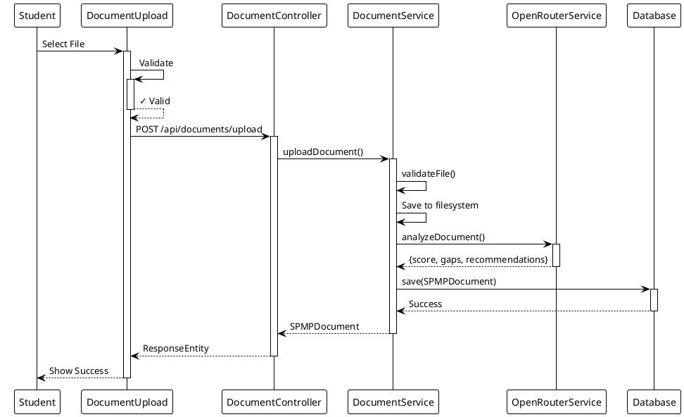

---

### Data Design

**ERD / Schema:**
```sql
CREATE TABLE spmp_documents (
    id BIGINT AUTO_INCREMENT PRIMARY KEY,
    file_name VARCHAR(255) NOT NULL,
    file_url VARCHAR(500) NOT NULL,
    file_size BIGINT,
    file_type VARCHAR(50),
    evaluated BOOLEAN DEFAULT FALSE,
    feedback LONGTEXT,
    user_id BIGINT NOT NULL,
    uploaded_at DATETIME DEFAULT CURRENT_TIMESTAMP,
    evaluated_at DATETIME,
    
    FOREIGN KEY (user_id) REFERENCES users(id) ON DELETE CASCADE,
    INDEX idx_user_id (user_id),
    INDEX idx_uploaded_at (uploaded_at)
);
```

---

## 2.2 Student File Edit (UC 2.2)

### Front-end Component(s)

**Component Name:** `DocumentList.jsx` with `FileReplaceModal.jsx`

**Description and purpose:**
Displays list of uploaded documents with metadata (file name, size, upload date, status). Provides actions: View Report, Replace (Edit), Delete. FileReplaceModal handles file replacement workflow with validation and confirmation.

**Component type or format:**
React Functional Component with conditional rendering. Uses state management for document list, selected document, and modal visibility. Integrates with apiService for CRUD operations.

---

### Back-end Component(s)

**Component Name:** `DocumentController.java` - PUT endpoint

**Description and purpose:**
REST API endpoint for document replacement. Validates new file, deletes old file, uploads replacement, and triggers re-evaluation.

**Component type or format:**
Spring Boot REST Controller with `@PutMapping` endpoint. Handles multipart file replacement requests with transaction management.

---

**Component Name:** `DocumentService.java` - replaceDocument()

**Description and purpose:**
Business logic for replacing uploaded documents. Validates new file, deletes old file from storage, saves new file, updates SPMPDocument entity, and re-evaluates with AI.

**Component type or format:**
Spring Service class with file operation methods. Uses file utilities for cleanup and DocumentRepository for persistence.

---

### Object-Oriented Components

**Class Diagram:**
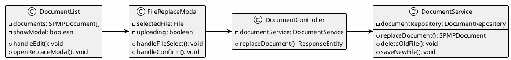

**Sequence Diagram:**
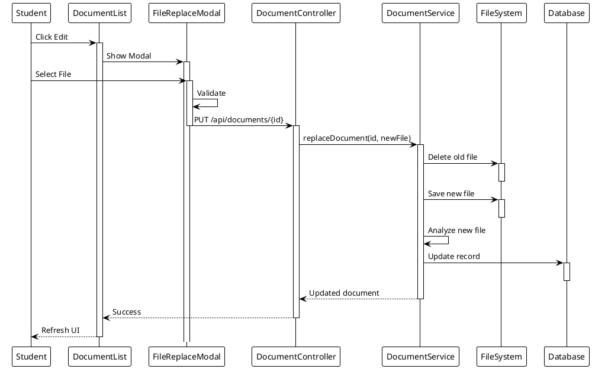

---

### Data Design

**Schema Changes:**
```sql
-- No schema change needed; updates existing spmp_documents record
ALTER TABLE spmp_documents ADD COLUMN replaced_count INT DEFAULT 0;
ALTER TABLE spmp_documents ADD COLUMN last_replaced_at DATETIME;
```

---

## 2.3 Student File Removal (UC 2.3)

### Front-end Component(s)

**Component Name:** `DocumentList.jsx` - Delete action

**Description and purpose:**
Delete button/action in document list. Shows confirmation dialog before permanent removal. Updates UI after successful deletion.

**Component type or format:**
React component with conditional rendering and confirmation dialog. Uses apiService to call backend delete endpoint.

---

### Back-end Component(s)

**Component Name:** `DocumentController.java` - DELETE endpoint

**Description and purpose:**
REST API endpoint for document deletion. Validates ownership, deletes file from storage and database.

**Component type or format:**
Spring Boot REST Controller with `@DeleteMapping` endpoint. Includes authorization checks.

---

**Component Name:** `DocumentService.java` - deleteDocument()

**Description and purpose:**
Business logic for document deletion. Verifies user ownership, deletes physical file, and removes database record.

**Component type or format:**
Spring Service class with file and database cleanup logic.

---

### Object-Oriented Components

**Class Diagram:**
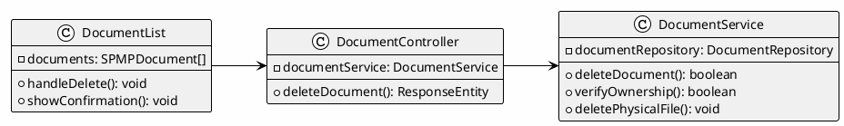

**Sequence Diagram:**
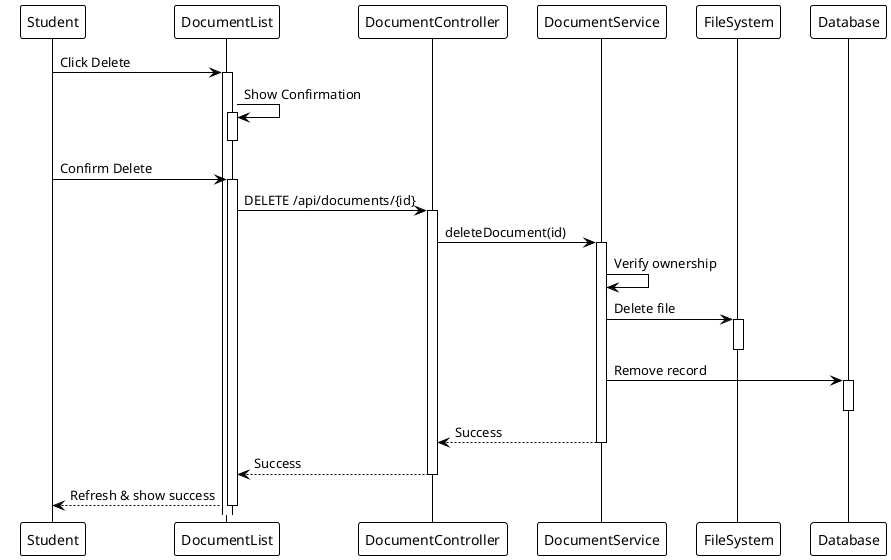

---

### Data Design

**Schema (no changes needed - uses existing spmp_documents table):**
```sql
-- Delete operation removes the record and associated file
DELETE FROM spmp_documents WHERE id = ? AND student_id = ?;

-- Cascade deletes also remove associated parser_feedback
DELETE FROM parser_feedback WHERE document_id = ?;
```

---

## 2.4 Student View Feedback (UC 2.4)

### Front-end Component(s)

**Component Name:** `EvaluationResults.jsx` + `ParserFeedback.jsx`

**Description and purpose:**
Displays AI evaluation results including compliance score, detected clauses, missing clauses, and recommendations. ParserFeedback shows detailed feedback broken down by section.

**Component type or format:**
React Functional Component displaying JSON feedback from ParserFeedback entity. Uses charts/visualizations for score display.

---

### Back-end Component(s)

**Component Name:** `ParserFeedbackService.java`

**Description and purpose:**
Orchestrates AI analysis via OpenRouterService and stores structured feedback in ParserFeedback entity.

**Component type or format:**
Spring Service class that integrates with OpenRouterService for IEEE 1058 compliance analysis.

---

### Object-Oriented Components

**Class Diagram:**
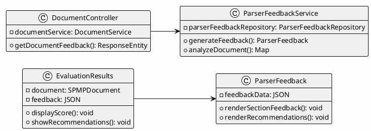

**Sequence Diagram:**
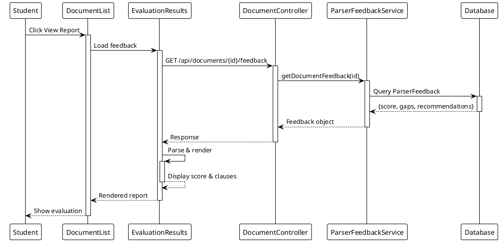

---

### Data Design

**Schema:**
```sql
CREATE TABLE parser_feedback (
    id BIGINT AUTO_INCREMENT PRIMARY KEY,
    document_id BIGINT NOT NULL,
    compliance_score DOUBLE,
    feedback_json LONGTEXT,
    created_at DATETIME,
    FOREIGN KEY (document_id) REFERENCES spmp_documents(id) ON DELETE CASCADE
);
```

---

## 2.5 Student Task Tracking (UC 2.5)

### Front-end Component(s)

**Component Name:** `TaskTracker.jsx`

**Description and purpose:**
Dashboard showing assigned tasks with filtering (Pending, In Progress, Completed, Overdue), sorting, and deadline highlighting. Displays task progress statistics.

**Component type or format:**
React Functional Component with state management. Uses date/time utilities for deadline calculations.

---

### Back-end Component(s)

**Component Name:** `TaskController.java`

**Description and purpose:**
REST endpoints for retrieving student's assigned tasks and updating task status.

**Component type or format:**
Spring Boot REST Controller with `@GetMapping` and `@PutMapping` endpoints.

---

**Component Name:** `TaskService.java`

**Description and purpose:**
Business logic for task retrieval, filtering, and status management. Calculates deadline status.

**Component type or format:**
Spring Service class with task query and calculation logic.

---

### Object-Oriented Components

**Class Diagram:**
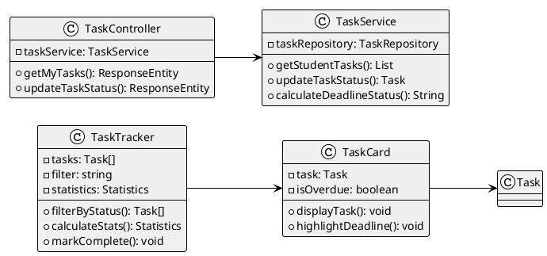

**Sequence Diagram:**
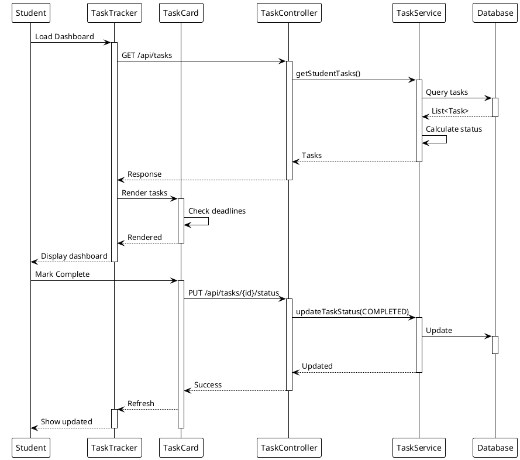

---

### Data Design

**Schema:**
```sql
CREATE TABLE tasks (
    id BIGINT AUTO_INCREMENT PRIMARY KEY,
    title VARCHAR(255) NOT NULL,
    description LONGTEXT,
    deadline DATETIME NOT NULL,
    is_completed BOOLEAN DEFAULT FALSE,
    completion_date DATE,
    assigned_to_user_id BIGINT NOT NULL,
    created_by_user_id BIGINT NOT NULL,
    priority ENUM('LOW', 'MEDIUM', 'HIGH') DEFAULT 'MEDIUM',
    status ENUM('PENDING', 'IN_PROGRESS', 'COMPLETED') DEFAULT 'PENDING',
    created_at DATETIME,
    
    FOREIGN KEY (assigned_to_user_id) REFERENCES users(id),
    FOREIGN KEY (created_by_user_id) REFERENCES users(id),
    INDEX idx_assigned_to (assigned_to_user_id),
    INDEX idx_deadline (deadline)
);
```

---

## 2.6 Professor Task Creation (UC 2.6)

### Front-end Component(s)

**Component Name:** `TaskManager.jsx`

**Description and purpose:**
Form interface for professors to create new tasks with title, description, deadline, and student assignment options. Includes validation and preview before submission.

**Component type or format:**
React Functional Component with form state management. Integrates with apiService for task submission and student list retrieval.

---

### Back-end Component(s)

**Component Name:** `TaskController.java` - POST endpoint

**Description and purpose:**
REST endpoint for creating new tasks. Validates task data and persists to database.

**Component type or format:**
Spring Boot REST Controller with `@PostMapping` endpoint. Includes authorization checks for professor role.

---

**Component Name:** `TaskService.java` - createTask()

**Description and purpose:**
Business logic for task creation. Validates deadline, creates Task entity, and notifies assigned students.

**Component type or format:**
Spring Service class with task creation and notification logic.

---

### Object-Oriented Components

**Class Diagram:**
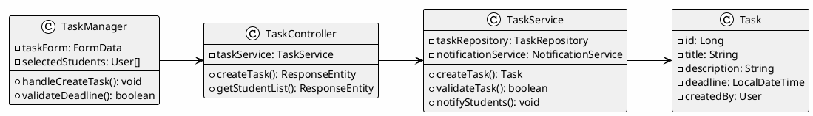

**Sequence Diagram:**
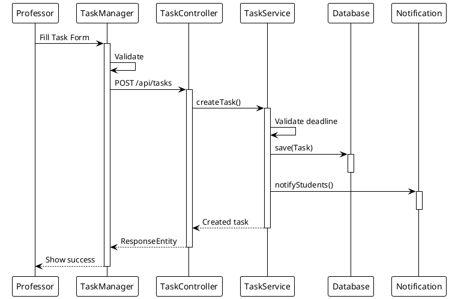

---

### Data Design

**Schema:**
```sql
CREATE TABLE tasks (
    id BIGINT AUTO_INCREMENT PRIMARY KEY,
    title VARCHAR(255) NOT NULL,
    description LONGTEXT,
    deadline DATETIME NOT NULL,
    status ENUM('PENDING', 'IN_PROGRESS', 'COMPLETED') DEFAULT 'PENDING',
    priority ENUM('LOW', 'MEDIUM', 'HIGH') DEFAULT 'MEDIUM',
    assigned_to_user_id BIGINT NOT NULL,
    created_by_user_id BIGINT NOT NULL,
    created_at DATETIME DEFAULT CURRENT_TIMESTAMP,
    updated_at DATETIME DEFAULT CURRENT_TIMESTAMP ON UPDATE CURRENT_TIMESTAMP,
    
    FOREIGN KEY (assigned_to_user_id) REFERENCES users(id) ON DELETE CASCADE,
    FOREIGN KEY (created_by_user_id) REFERENCES users(id) ON DELETE CASCADE,
    INDEX idx_assigned_to (assigned_to_user_id),
    INDEX idx_created_by (created_by_user_id),
    INDEX idx_deadline (deadline),
    INDEX idx_status (status)
);
```

---

## 2.7 Professor Supplement Grading Criteria (UC 2.7)

### Front-end Component(s)

**Component Name:** `GradingCriteria.jsx`

**Description and purpose:**
Interface for professors to define custom grading criteria with weightings. Displays criteria list and allows add/edit/delete operations.

**Component type or format:**
React Functional Component with criteria state management and inline editing capabilities.

---

### Back-end Component(s)

**Component Name:** `GradingCriteriaService.java`

**Description and purpose:**
Business logic for managing custom grading criteria. Stores criteria and applies to evaluations.

**Component type or format:**
Spring Service class with criteria CRUD operations.

---

### Object-Oriented Components

**Class Diagram:**
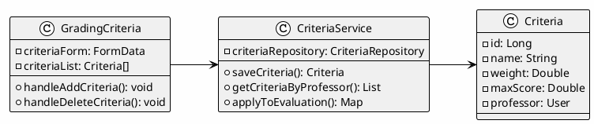

**Sequence Diagram:**
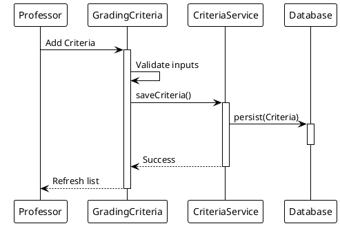

---

### Data Design

**Schema:**
```sql
CREATE TABLE grading_criteria (
    id BIGINT AUTO_INCREMENT PRIMARY KEY,
    professor_id BIGINT NOT NULL,
    name VARCHAR(255) NOT NULL,
    description VARCHAR(500),
    weight DOUBLE NOT NULL DEFAULT 1.0,
    max_score DOUBLE NOT NULL DEFAULT 100.0,
    created_at DATETIME DEFAULT CURRENT_TIMESTAMP,
    updated_at DATETIME DEFAULT CURRENT_TIMESTAMP ON UPDATE CURRENT_TIMESTAMP,
    
    FOREIGN KEY (professor_id) REFERENCES users(id) ON DELETE CASCADE,
    INDEX idx_professor_id (professor_id),
    UNIQUE KEY unique_criteria_per_prof (professor_id, name)
);
```

---

## 2.8 Professor Override AI Results (UC 2.8)

### Front-end Component(s)

**Component Name:** `ScoreOverride.jsx`

**Description and purpose:**
Interface showing AI evaluation results with ability to override scores and add justification comments.

**Component type or format:**
React Component displaying evaluation data with input fields for manual adjustments.

---

### Back-end Component(s)

**Component Name:** `ScoreOverrideService.java`

**Description and purpose:**
Business logic for handling score overrides. Validates overrides and maintains audit trail.

**Component type or format:**
Spring Service class with override validation and audit logging.

---

### Object-Oriented Components

**Class Diagram:**
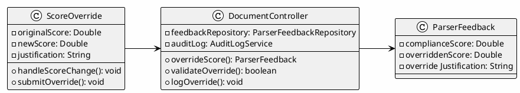

**Sequence Diagram:**
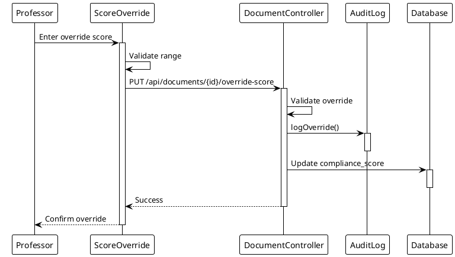

---

### Data Design

**Schema Changes:**
```sql
ALTER TABLE parser_feedback ADD COLUMN overridden_score DOUBLE DEFAULT NULL;
ALTER TABLE parser_feedback ADD COLUMN override_justification LONGTEXT DEFAULT NULL;
ALTER TABLE parser_feedback ADD COLUMN overridden_by_user_id BIGINT DEFAULT NULL;
ALTER TABLE parser_feedback ADD COLUMN overridden_at DATETIME DEFAULT NULL;
ALTER TABLE parser_feedback ADD FOREIGN KEY (overridden_by_user_id) REFERENCES users(id) ON DELETE SET NULL;
ALTER TABLE parser_feedback ADD INDEX idx_overridden_by (overridden_by_user_id);
```

---

## 2.9 Professor Update Tasks (UC 2.9)

### Front-end Component(s)

**Component Name:** `TaskManager.jsx` - Edit mode

**Description and purpose:**
Form interface for editing existing task details like instructions, deadlines, and student assignments.

**Component type or format:**
React Component with task data pre-population and update submission.

---

### Back-end Component(s)

**Component Name:** `TaskController.java` - PUT endpoint

**Description and purpose:**
REST endpoint for task updates. Validates changes and notifies affected students.

**Component type or format:**
Spring Boot REST Controller with `@PutMapping` endpoint.

---

**Component Name:** `TaskService.java` - updateTask()

**Description and purpose:**
Business logic for task updates. Handles deadline changes, student assignments, and notifications.

**Component type or format:**
Spring Service class with task update and notification logic.

---

### Object-Oriented Components

**Class Diagram:**
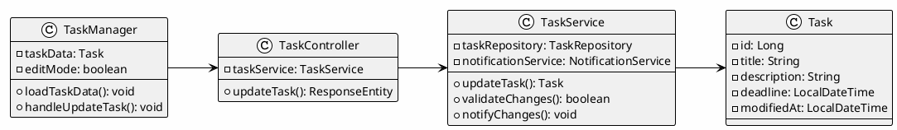

**Sequence Diagram:**
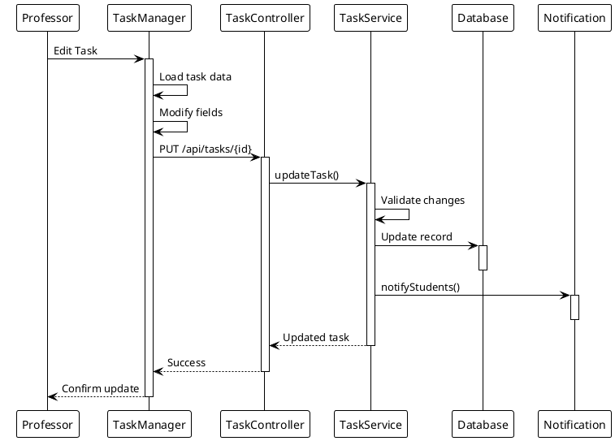

---

### Data Design

**Schema Changes:**
```sql
ALTER TABLE tasks ADD COLUMN updated_by_user_id BIGINT DEFAULT NULL;
ALTER TABLE tasks ADD FOREIGN KEY (updated_by_user_id) REFERENCES users(id) ON DELETE SET NULL;
ALTER TABLE tasks ADD COLUMN previous_deadline DATETIME DEFAULT NULL;
ALTER TABLE tasks ADD INDEX idx_updated_at (updated_at);
```

---

## 2.10 Professor Monitor Student Progress (UC 2.10)

### Front-end Component(s)

**Component Name:** `StudentProgress.jsx`

**Description and purpose:**
Dashboard showing student submission status, evaluation scores, and progress statistics with filtering and sorting options.

**Component type or format:**
React Component with data visualization and filtering capabilities.

---

### Back-end Component(s)

**Component Name:** `ReportingController.java`

**Description and purpose:**
REST endpoints for retrieving student progress data and statistics. Contains getStudentProgress() method that aggregates document and task completion metrics.

**Component type or format:**
Spring Boot REST Controller with `@GetMapping` endpoints including /api/reports/student-progress/{userId}.

---

### Object-Oriented Components

**Class Diagram:**
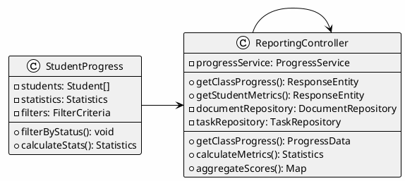

**Sequence Diagram:**
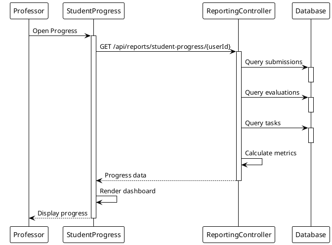

---

### Data Design

**Schema (for progress views - no new tables, uses existing data):**
```sql
-- Query aggregates data from existing tables
SELECT 
    s.id,
    s.first_name,
    s.last_name,
    COUNT(d.id) as total_documents,
    COUNT(pf.id) as evaluated_documents,
    AVG(pf.compliance_score) as avg_score,
    COUNT(t.id) as assigned_tasks,
    SUM(CASE WHEN t.status = 'COMPLETED' THEN 1 ELSE 0 END) as completed_tasks
FROM users s
LEFT JOIN spmp_documents d ON s.id = d.student_id
LEFT JOIN parser_feedback pf ON d.id = pf.document_id
LEFT JOIN tasks t ON s.id = t.assigned_to_user_id
WHERE s.role = 'STUDENT'
GROUP BY s.id, s.first_name, s.last_name;
```

---

## 2.11 Admin User Management (UC 2.11)

### Front-end Component(s)

**Component Name:** `UserManagement.jsx`

**Description and purpose:**
Admin interface for viewing, creating, editing, and deleting user accounts with role assignment and status management.

**Component type or format:**
React Component with user list display, modal forms for CRUD operations, and search/filter capabilities.

---

### Back-end Component(s)

**Component Name:** `AdminUserController.java`

**Description and purpose:**
REST endpoints for user CRUD operations. Enforces admin authorization and validates user data.

**Component type or format:**
Spring Boot REST Controller with `@GetMapping`, `@PostMapping`, `@PutMapping`, `@DeleteMapping` endpoints.

---

**Component Name:** `UserService.java`

**Description and purpose:**
Business logic for user management including validation, password management, and audit logging. Used by AdminUserController for user lifecycle operations.

**Component type or format:**
Spring Service class with user lifecycle management.

---

### Object-Oriented Components

**Class Diagram:**
```plantuml
@startuml UserManagement_ClassDiagram
!theme plain
left to right direction
skinparam backgroundColor #FEFEFE
skinparam classBackgroundColor #F0F0F0

class UserManagement {
  - userList: User[]
  - filters: FilterCriteria
  --
  + handleCreateUser(): void
  + handleEditUser(): void
  + handleDeleteUser(): void
}

class AdminUserController {
  - userService: UserService
  --
  + getAllUsers(): ResponseEntity
  + createUser(): ResponseEntity
  + updateUser(): ResponseEntity
  + deleteUser(): ResponseEntity
}

class UserService {
  - userRepository: UserRepository
  - passwordEncoder: PasswordEncoder
  - auditLog: AuditLogService
  --
  + createUser(): User
  + updateUser(): User
  + deleteUser(): boolean
  + validateUser(): boolean
}

class User {
  - id: Long
  - email: String
  - role: Role
  - status: Status
  - createdAt: LocalDateTime
}

UserManagement --> AdminUserController
AdminUserController --> UserService
UserService --> User
@enduml
```

**Sequence Diagram:**
```plantuml
@startuml UserManagement_Sequence
!theme plain
participant "Admin" as Admin
participant "UserManagement" as UI
participant "AdminUserController" as Ctrl
participant "UserService" as Service
participant "Database" as DB
participant "Audit" as AuditLog

Admin -> UI: Open User Management
activate UI
UI -> Ctrl: GET /api/admin/users
activate Ctrl
Ctrl -> Service: getAllUsers()
activate Service
Service -> DB: Query users
activate DB
DB --> Service: List<User>
deactivate DB
Service --> Ctrl: Users
deactivate Service
Ctrl --> UI: Response
deactivate Ctrl
UI --> Admin: Display user list
deactivate UI

Admin -> UI: Create User
activate UI
UI -> Ctrl: POST /api/admin/users
activate Ctrl
Ctrl -> Service: createUser()
activate Service
Service -> Service: Validate input
Service -> DB: persist(User)
activate DB
deactivate DB
Service -> AuditLog: logCreation()
activate AuditLog
deactivate AuditLog
Service --> Ctrl: Created user
deactivate Service
Ctrl --> UI: Success
deactivate Ctrl
UI --> Admin: Confirm creation
deactivate UI
@enduml
```

---

### Data Design

**Schema (uses existing users table - no changes needed):**
```sql
-- Users table already contains: id, email, first_name, last_name, role, status, created_at
SELECT * FROM users WHERE role IN ('STUDENT', 'PROFESSOR', 'ADMIN');
```

---

## 2.12 Admin Student Assignment (UC 2.12)

### Front-end Component(s)

**Component Name:** `StudentAssignmentForm.jsx`

**Description and purpose:**
Form interface for assigning students to professors with bulk assignment options and confirmation dialogs.

**Component type or format:**
React Component with multi-select dropdown and assignment submission.

---

### Back-end Component(s)

**Component Name:** `AssignmentController.java`

**Description and purpose:**
REST endpoints for creating and managing student-professor assignments.

**Component type or format:**
Spring Boot REST Controller with assignment CRUD endpoints.

---

**Component Name:** `AssignmentService.java`

**Description and purpose:**
Business logic for assignment management and notification of assigned parties.

**Component type or format:**
Spring Service class with assignment creation and notification logic.

---

### Object-Oriented Components

**Class Diagram:**
```plantuml
@startuml StudentAssignment_ClassDiagram
!theme plain
left to right direction
skinparam backgroundColor #FEFEFE
skinparam classBackgroundColor #F0F0F0

class StudentAssignmentForm {
  - selectedProfessor: User
  - selectedStudents: User[]
  --
  + handleAssign(): void
  + handleBulkAssign(): void
}

class AssignmentController {
  - assignmentService: AssignmentService
  --
  + assignStudent(): ResponseEntity
  + bulkAssign(): ResponseEntity
}

class AssignmentService {
  - assignmentRepository: AssignmentRepository
  - notificationService: NotificationService
  --
  + assignStudent(): Assignment
  + bulkAssign(): List
  + notifyParties(): void
}

class Assignment {
  - id: Long
  - student: User
  - professor: User
  - assignedAt: LocalDateTime
}

StudentAssignmentForm --> AssignmentController
AssignmentController --> AssignmentService
AssignmentService --> Assignment
@enduml
```

**Sequence Diagram:**
```plantuml
@startuml StudentAssignment_Sequence
!theme plain
participant "Admin" as Admin
participant "AssignmentForm" as UI
participant "AssignmentController" as Ctrl
participant "AssignmentService" as Service
participant "Database" as DB
participant "Notification" as Notif

Admin -> UI: Select Professor & Students
activate UI
UI -> UI: Validate selections
UI -> Ctrl: POST /api/admin/assignments
activate Ctrl
Ctrl -> Service: assignStudent()
activate Service
Service -> Service: Verify users exist
Service -> DB: persist(Assignment)
activate DB
deactivate DB
Service -> Notif: notifyProfessor()
activate Notif
deactivate Notif
Service -> Notif: notifyStudent()
activate Notif
deactivate Notif
Service --> Ctrl: Assignment created
deactivate Service
Ctrl --> UI: Success
deactivate Ctrl
UI --> Admin: Confirm assignment
deactivate UI
@enduml
```

---

### Data Design

**Schema:**
```sql
CREATE TABLE student_professor_assignments (
    id BIGINT AUTO_INCREMENT PRIMARY KEY,
    student_id BIGINT NOT NULL,
    professor_id BIGINT NOT NULL,
    assigned_by BIGINT NOT NULL,
    assigned_at DATETIME NOT NULL DEFAULT CURRENT_TIMESTAMP,
    notes TEXT,
    
    FOREIGN KEY (student_id) REFERENCES users(id) ON DELETE CASCADE,
    FOREIGN KEY (professor_id) REFERENCES users(id) ON DELETE CASCADE,
    FOREIGN KEY (assigned_by) REFERENCES users(id) ON DELETE SET NULL,
    UNIQUE KEY unique_assignment (student_id, professor_id),
    INDEX idx_professor (professor_id),
    INDEX idx_assigned_at (assigned_at)
);
```

---

## 2.13 Admin View Audit Logs (UC 2.13)

### Front-end Component(s)

**Component Name:** `AuditLogViewer.jsx`

**Description and purpose:**
Interface for viewing paginated audit logs with filtering by date, user, and action type. Supports log export to CSV/PDF.

**Component type or format:**
React Component with table display, date pickers, and export functionality.

---

### Back-end Component(s)

**Component Name:** `AuditLogController.java`

**Description and purpose:**
REST endpoints for retrieving audit logs with filtering and pagination.

**Component type or format:**
Spring Boot REST Controller with `@GetMapping` endpoints for log retrieval.

---

**Component Name:** `AuditLogService.java`

**Description and purpose:**
Business logic for audit log retrieval, filtering, and export operations.

**Component type or format:**
Spring Service class with log querying and export logic.

---

### Object-Oriented Components

**Class Diagram:**
```plantuml
@startuml AuditLogViewer_ClassDiagram
!theme plain
left to right direction
skinparam backgroundColor #FEFEFE
skinparam classBackgroundColor #F0F0F0

class AuditLogViewer {
  - logs: AuditLog[]
  - filters: FilterCriteria
  - pagination: PaginationData
  --
  + filterByDate(): void
  + filterByUser(): void
  + exportLogs(): void
}

class AuditLogController {
  - auditLogService: AuditLogService
  --
  + getLogs(): ResponseEntity
  + exportLogs(): ResponseEntity
}

class AuditLogService {
  - auditLogRepository: AuditLogRepository
  - exportService: ExportService
  --
  + getLogs(): Page
  + filterLogs(): List
  + exportToCSV(): File
}

class AuditLog {
  - id: Long
  - user: User
  - action: String
  - resource: String
  - timestamp: LocalDateTime
}

AuditLogViewer --> AuditLogController
AuditLogController --> AuditLogService
AuditLogService --> AuditLog
@enduml
```

**Sequence Diagram:**
```plantuml
@startuml AuditLogViewer_Sequence
!theme plain
participant "Admin" as Admin
participant "AuditLogViewer" as UI
participant "AuditLogController" as Ctrl
participant "AuditLogService" as Service
participant "Database" as DB

Admin -> UI: Open Audit Logs
activate UI
UI -> Ctrl: GET /api/admin/audit-logs
activate Ctrl
Ctrl -> Service: getLogs()
activate Service
Service -> DB: Query logs
activate DB
DB --> Service: Page<AuditLog>
deactivate DB
Service --> Ctrl: Logs
deactivate Service
Ctrl --> UI: Response
deactivate Ctrl
UI --> Admin: Display logs
deactivate UI

Admin -> UI: Filter by Date
activate UI
UI -> Ctrl: GET /api/admin/audit-logs?startDate=X&endDate=Y
activate Ctrl
Ctrl -> Service: filterLogs()
activate Service
Service -> DB: Query with filters
activate DB
deactivate DB
Service --> Ctrl: Filtered logs
deactivate Service
Ctrl --> UI: Response
deactivate Ctrl
UI --> Admin: Update display
deactivate UI
@enduml
```

---

### Data Design

**Schema:**
```sql
CREATE TABLE audit_logs (
    id BIGINT AUTO_INCREMENT PRIMARY KEY,
    user_id BIGINT NOT NULL,
    action VARCHAR(255) NOT NULL,
    resource_type VARCHAR(100),
    resource_id BIGINT,
    details LONGTEXT,
    timestamp DATETIME NOT NULL DEFAULT CURRENT_TIMESTAMP,
    ip_address VARCHAR(50),
    
    FOREIGN KEY (user_id) REFERENCES users(id) ON DELETE SET NULL,
    INDEX idx_user_id (user_id),
    INDEX idx_timestamp (timestamp),
    INDEX idx_action (action),
    INDEX idx_resource (resource_type, resource_id)
);
```

---

## 2.14 Admin System Reports (UC 2.14)

### Front-end Component(s)

**Component Name:** `AdminReports.jsx`

**Description and purpose:**
Dashboard for generating system reports with visualizations, including user statistics, submission trends, and evaluation metrics.

**Component type or format:**
React Component with chart rendering, parameter selection, and export options.

---

### Back-end Component(s)

**Component Name:** `ReportingController.java`

**Description and purpose:**
REST endpoints for report generation with various metrics and data aggregation. Handles compliance statistics, student performance, and trends.

**Component type or format:**
Spring Boot REST Controller with report generation endpoints at /api/reports/*.

---

**Component Name:** `ReportExportService.java`

**Description and purpose:**
Business logic for exporting reports to PDF/Excel formats using Apache PDFBox and Apache POI libraries.

**Component type or format:**
Spring Service class with document generation and formatting logic.

---

### Object-Oriented Components

**Class Diagram:**
```plantuml
@startuml AdminReports_ClassDiagram
!theme plain
left to right direction
skinparam backgroundColor #FEFEFE
skinparam classBackgroundColor #F0F0F0

class AdminReports {
  - reportType: String
  - dateRange: DateRange
  - reportData: ReportData
  --
  + generateReport(): void
  + exportReport(): void
}

class ReportingController {
  - complianceScoreRepository: ComplianceScoreRepository
  - documentRepository: SPMPDocumentRepository
  - userService: UserService
  - taskService: TaskService
  --
  + getComplianceStatistics(): ResponseEntity
  + getComplianceTrends(): ResponseEntity
}

class ReportExportService {
  - complianceScoreRepository: Repository
  --
  + generatePDF(): File
  + generateExcel(): File
}

AdminReports --> ReportingController
ReportingController --> ReportExportService
@enduml
```

**Sequence Diagram:**
```plantuml
@startuml AdminReports_Sequence
!theme plain
participant "Admin" as Admin
participant "AdminReports" as UI
participant "ReportingController" as Ctrl
participant "ReportExportService" as Service
participant "Database" as DB

Admin -> UI: Select Report Type
activate UI
UI -> UI: Set parameters
UI -> Ctrl: GET /api/admin/reports/{type}
activate Ctrl
Ctrl -> Service: generateReport()
activate Service
Service -> DB: Query data
activate DB
deactivate DB
Service -> Service: Aggregate metrics
Service --> Ctrl: Report data
deactivate Service
Ctrl --> UI: Response
deactivate Ctrl
UI -> UI: Render charts
UI --> Admin: Display report
deactivate UI

Admin -> UI: Export Report
activate UI
UI -> Ctrl: GET /api/admin/reports/{type}/export
activate Ctrl
Ctrl -> Service: exportReport()
activate Service
Service -> Service: Format data
Service --> Ctrl: File
deactivate Service
Ctrl --> UI: Download
deactivate Ctrl
UI --> Admin: File saved
deactivate UI
@enduml
```

---

### Data Design

**Schema (aggregates data from existing tables):**
```sql
-- Report queries use existing tables
-- User Statistics
SELECT role, COUNT(*) as count FROM users GROUP BY role;

-- Submission Trends
SELECT DATE(uploaded_at) as submission_date, COUNT(*) as count 
FROM spmp_documents 
GROUP BY DATE(uploaded_at) 
ORDER BY submission_date DESC;

-- Evaluation Metrics
SELECT 
    COUNT(DISTINCT d.id) as total_evaluated,
    AVG(pf.compliance_score) as avg_compliance,
    MIN(pf.compliance_score) as min_score,
    MAX(pf.compliance_score) as max_score
FROM spmp_documents d
JOIN parser_feedback pf ON d.id = pf.document_id;
```

---

## 2.15 Admin System Settings (UC 2.15)

### Front-end Component(s)

**Component Name:** `SystemSettingsForm.jsx`

**Description and purpose:**
Form interface for managing system-wide settings including registration controls, evaluation parameters, and notification settings.

**Component type or format:**
React Component with settings form, validation, and save confirmation.

---

### Back-end Component(s)

**Component Name:** `SystemSettingsController.java`

**Description and purpose:**
REST endpoints for system settings CRUD operations with validation.

**Component type or format:**
Spring Boot REST Controller with settings management endpoints.

---

**Component Name:** `SystemSettingService.java`

**Description and purpose:**
Business logic for settings management, validation, and application of changes.

**Component type or format:**
Spring Service class with settings persistence and validation.

---

### Object-Oriented Components

**Class Diagram:**
```plantuml
@startuml SystemSettings_ClassDiagram
!theme plain
left to right direction
skinparam backgroundColor #FEFEFE
skinparam classBackgroundColor #F0F0F0

class SystemSettingsForm {
  - settings: Map<String, Object>
  - changes: Map<String, Object>
  --
  + handleSettingChange(): void
  + submitSettings(): void
}

class SystemSettingsController {
  - systemSettingService: SystemSettingService
  --
  + getSettings(): ResponseEntity
  + updateSettings(): ResponseEntity
}

class SystemSettingService {
  - settingRepository: SystemSettingRepository
  - configCache: ConfigCache
  --
  + getSettings(): Map
  + updateSettings(): boolean
  + validateSetting(): boolean
}

class SystemSetting {
  - id: Long
  - key: String
  - value: String
  - dataType: String
  - updatedAt: LocalDateTime
}

SystemSettingsForm --> SystemSettingsController
SystemSettingsController --> SystemSettingService
SystemSettingService --> SystemSetting
@enduml
```

**Sequence Diagram:**
```plantuml
@startuml SystemSettings_Sequence
!theme plain
participant "Admin" as Admin
participant "SettingsForm" as UI
participant "SystemSettingsController" as Ctrl
participant "SystemSettingService" as Service
participant "Database" as DB
participant "Cache" as Cache

Admin -> UI: Open Settings
activate UI
UI -> Ctrl: GET /api/admin/settings
activate Ctrl
Ctrl -> Service: getSettings()
activate Service
Service -> Cache: Check cache
Service -> DB: Query settings
activate DB
DB --> Service: Settings
deactivate DB
Service -> Cache: Update cache
Service --> Ctrl: Settings
deactivate Service
Ctrl --> UI: Response
deactivate Ctrl
UI --> Admin: Display form
deactivate UI

Admin -> UI: Modify Settings
activate UI
UI -> UI: Validate input
UI -> Ctrl: POST /api/admin/settings
activate Ctrl
Ctrl -> Service: updateSettings()
activate Service
Service -> Service: Validate all settings
Service -> DB: Batch update
activate DB
deactivate DB
Service -> Cache: Refresh cache
Service --> Ctrl: Success
deactivate Service
Ctrl --> UI: Confirm
deactivate Ctrl
UI --> Admin: Show success
deactivate UI
@enduml
```

---

**Data Design:**

```sql
CREATE TABLE system_settings (
    id BIGINT AUTO_INCREMENT PRIMARY KEY,
    key VARCHAR(255) NOT NULL UNIQUE,
    value LONGTEXT,
    data_type ENUM('STRING', 'INTEGER', 'BOOLEAN', 'DOUBLE') DEFAULT 'STRING',
    description VARCHAR(500),
    updated_at DATETIME DEFAULT CURRENT_TIMESTAMP ON UPDATE CURRENT_TIMESTAMP,
    updated_by BIGINT,
    
    INDEX idx_key (key),
    FOREIGN KEY (updated_by) REFERENCES users(id) ON DELETE SET NULL
);
```

---

