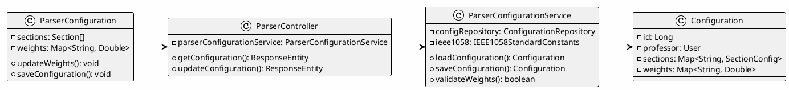
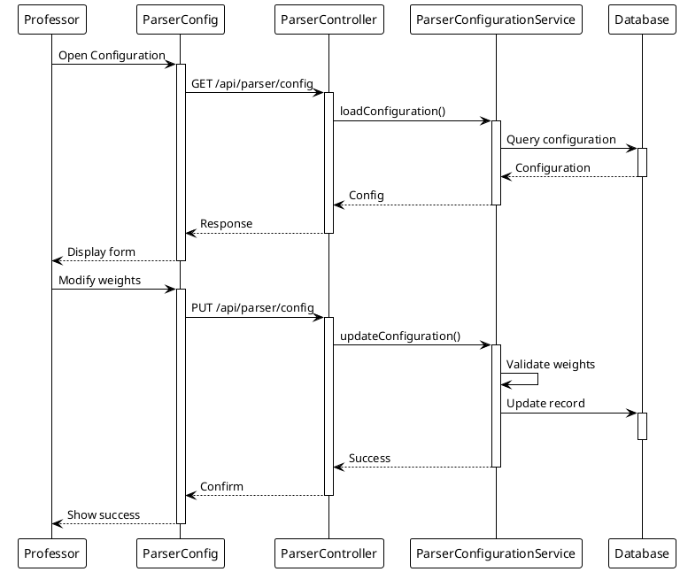

# Module 3: Automated Document Parsing and Compliance

## Use Case Descriptions (UC 3.1 - 3.3)

This module documents all use cases for the SPMP Evaluator system related to **Document Parsing** and **IEEE 1058 Compliance**.

> **Legend:** ✅ = Implemented | 🔄 = In Progress | ❌ = Not Started

---

## UC 3.1: Upload SPMP Document

| Field | Description |
|:------|:------------|
| **Use Case Name** | Upload SPMP Document |
| **Primary Actor** | Student |
| **Secondary Actors** | Parser Module |
| **Description** | Allows a **Student** to upload an SPMP document for automated compliance evaluation against the **IEEE 1058 standard**. The system validates the file, preprocesses it, and forwards it to the parser module for clause detection and AI-based compliance analysis. |
| **Preconditions** | User must be authenticated. Parser module must be configured by the Professor. SPMP document must be in a supported format. |
| **Postconditions** | Document is stored and queued for parsing. Parser module receives document for analysis. |

### Basic Flow ✅ IMPLEMENTED

| Step | Action | Status |
|:----:|:-------|:------:|
| 1 | User navigates to upload section | ✅ |
| 2 | User selects SPMP document file | ✅ |
| 3 | System validates file format and size | ✅ |
| 4 | System stores document in database | ✅ |
| 5 | System forwards document to parser module | ✅ `DocumentParser.java` |
| 6 | System displays upload confirmation | ✅ |

> **Note:** Complete implementation with PDF/DOCX text extraction using Apache PDFBox and Apache POI.

### Alternative Flows
- **Invalid format:** System displays error and lists supported formats
- **File too large:** System rejects and suggests compression

### Exceptions
- **Parser unavailable:** System queues document for later processing

---

## UC 3.2: Configure Parser Module

| Field | Description |
|:------|:------------|
| **Use Case Name** | Configure Parser Module |
| **Primary Actor** | Professor |
| **Secondary Actors** | System |
| **Description** | Allows the **Professor to configure the Automated Parser Module** by adjusting clause weights, defining rule mappings, and setting evaluation parameters to align with the IEEE 1058 standard. |
| **Preconditions** | Professor must be authenticated. Parser module must be initialized. System access permissions must allow configuration changes. |
| **Postconditions** | Parser configuration (rules, clause weights, and criteria) is saved successfully. Updated configuration is applied to future SPMP evaluations. |

### Basic Flow ✅ IMPLEMENTED

| Step | Action | Status |
|:----:|:-------|:------:|
| 1 | Professor navigates to parser configuration | ✅ |
| 2 | Professor views current IEEE 1058 clause mappings | ✅ |
| 3 | Professor adjusts clause weights | ✅ |
| 4 | Professor defines custom rule mappings | ✅ |
| 5 | System validates configuration | ✅ |
| 6 | System saves and applies configuration | ✅ |

> **Note:** Parser Configuration fully implemented with backend API, database persistence, and frontend UI.

### Alternative Flows
- **Reset to defaults:** Professor restores original IEEE 1058 mappings
- **Import configuration:** Professor loads pre-defined configuration template

### Exceptions
- **Invalid weights:** System prevents saving and highlights errors

---

## UC 3.3: View Parser Feedback

| Field | Description |
|:------|:------------|
| **Use Case Name** | View Parser Feedback |
| **Primary Actor** | Student, Professor |
| **Secondary Actors** | System |
| **Description** | Allows authorized users to view the **structured parser feedback** generated from the evaluation of uploaded SPMP documents. Uses **hybrid approach**: IEEE 1058 keyword-based detection (Phase 1) enhanced with AI-generated recommendations (Phase 2). Feedback includes compliance scores, missing clauses, and actionable recommendations. |
| **Preconditions** | SPMP document must have been successfully uploaded and processed. Parser feedback must be generated and stored. User must be authenticated with appropriate role. |
| **Postconditions** | User successfully views structured compliance feedback with keyword-based baseline and optional AI enhancement. System logs access activity for auditing and version tracking. |

### Basic Flow ✅ IMPLEMENTED

| Step | Action | Status |
|:----:|:-------|:------:|
| 1 | User navigates to feedback section | ✅ |
| 2 | User selects evaluated document | ✅ |
| 3 | System retrieves parser feedback (Phase 1: Keywords) | ✅ `ComplianceEvaluationService.java` |
| 4 | System displays compliance scores (keyword-based) | ✅ Deterministic scoring |
| 5 | System enhances with AI recommendations (Phase 2, optional) | ✅ `OpenRouterService.java` (amazon/nova-lite-v1:free) |
| 6 | System shows findings and recommendations | ✅ Keyword baseline + AI enhancement |
| 7 | System logs viewing activity | ✅ |

> **Note:** Hybrid architecture using IEEE 1058 keyword matching (Phase 1, ~300ms) with optional Amazon Nova AI enhancement (Phase 2, 1-2s per section). 10-second timeout ensures responsive UI. Falls back to keyword findings if AI unavailable.

### Alternative Flows
- **Export feedback:** User downloads feedback as PDF/CSV
- **Compare versions:** User views feedback differences between document versions

### Exceptions
- **Parsing incomplete:** System shows "Processing" status with estimated time

---

## Implementation Summary

| Use Case | Description | Status |
|:---------|:------------|:------:|
| UC 3.1 | Upload SPMP Document | ✅ Complete with PDF/DOCX parsing |
| UC 3.2 | Configure Parser Module | ✅ Full CRUD with UI |
| UC 3.3 | View Parser Feedback | ✅ AI-powered analysis |

**Total: 3/3 Use Cases FULLY IMPLEMENTED ✅**

### Current Architecture - HYBRID APPROACH ✅

**Phase 1: Keyword-Based Compliance Detection** (Always Runs)
1. **Document Parsing** ✅
   - `DocumentParser.java` - Extracts text from PDF/DOCX using Apache PDFBox + Apache POI
   - `IEEE1058StandardConstants.java` - Defines IEEE 1058 section keywords
   - Pattern matching and keyword detection for clause identification

2. **Compliance Scoring - Deterministic** ✅
   - `ComplianceEvaluationService.java` - Phase 1: Keyword-based scoring
   - Calculates section coverage (0-100%) based on keyword matches
   - Weighted scoring: Organization=12%, Risk=10%, Master Schedule=10%, ..., Glossary=5%
   - Performance: ~300ms total (12 sections, all evaluated)
   - Fully deterministic - same document always gets same score

**Phase 2: AI Enhancement** (Optional, Non-Blocking)
3. **AI-Powered Recommendations** ✅
   - `OpenRouterService.java` - Model: `amazon/nova-lite-v1:free` (FREE tier)
   - Timeout: 10 seconds per section (prevents hanging)
   - Only applied to sections marked as "present" from Phase 1
   - Generates human-readable findings and recommendations
   - Fallback: If AI timeout/error → uses keyword findings immediately
   - Performance: 1-2 seconds per present section (optional enhancement)

### Architecture Diagram

```
Student Upload (PDF/DOCX)
         ↓
[DocumentParser.java]
  Text Extraction (~50ms)
         ↓
[IEEE1058StandardConstants.java]
  Keyword Pattern Matching
         ↓
╔═════════════════════════════════════════════════════════╗
║ PHASE 1: Keyword Analysis (ALWAYS - ~300ms total)    ║
║ [ComplianceEvaluationService.java]                    ║
║  • 12 IEEE 1058 sections evaluated                    ║
║  • Keywords matched: coverage % calculated           ║
║  • Weighted scoring applied                          ║
║  • Deterministic overall score (0-100%)              ║
║  • Keyword-based findings & recommendations          ║
╚═════════════════════════════════════════════════════════╝
         ↓
  Main Score ✅ (ALWAYS AVAILABLE)
         ↓
╔═════════════════════════════════════════════════════════╗
║ PHASE 2: AI Enhancement (OPTIONAL - 1-2s/section)    ║
║ [OpenRouterService.java - amazon/nova-lite-v1:free]  ║
║ • IF: Section present && OpenRouter configured       ║
║   - Send content to Amazon Nova AI                    ║
║   - 10-second timeout (prevents hanging)              ║
║   - Parse AI findings & recommendations               ║
║   - REPLACE keyword findings with AI findings         ║
║ • ELSE: Use keyword findings (fallback)               ║
║   - If AI timeout/error → immediate fallback          ║
║   - System remains responsive                         ║
╚═════════════════════════════════════════════════════════╝
         ↓
Feedback Display
  • Overall Score: 75% (from Phase 1)
  • Findings: AI-enhanced (or keyword if AI failed)
  • Recommendations: AI-powered (or keyword if AI failed)
```

### Performance Comparison

| Metric | Phase 1 Only | Phase 1 + Phase 2 |
|--------|:----------:|:------------------:|
| **Speed** | ~300ms | ~300ms + 1-2s × present sections |
| **Reliability** | 100% | 100% (AI optional) |
| **API Calls** | 0 | 6-8 (only present sections) |
| **Cost** | FREE | FREE (OpenRouter free tier) |
| **User Experience** | Fast results immediately | Fast results + enhanced insights |

### Why Hybrid Approach?

**Phase 1 (Keywords):**
- ✅ **Deterministic** - Same document = same score always
- ✅ **Fast** - ~300ms, no API overhead
- ✅ **Reliable** - Works offline, no dependencies
- ✅ **Transparent** - Clear why sections scored low
- ✅ **Auditable** - Reproducible and defensible scoring

**Phase 2 (AI Enhancement):**
- ✅ **Semantic Understanding** - Understands context beyond keywords
- ✅ **Natural Language** - Readable recommendations
- ✅ **Context-Aware** - Can explain why findings matter
- ✅ **Optional** - Gracefully degrades if unavailable
- ✅ **Safe** - Non-blocking with 10-second timeout

### When to Use Each Phase

- **Always Use Phase 1**: For official scores and grading decisions
- **Use Phase 2**: For detailed, actionable student feedback
- **Fallback Strategy**: If AI unavailable → Phase 1 results are complete and sufficient

---

## Implementation Summary

| Use Case | Description | Implementation | Status |
|:---------|:------------|:---------------:|:------:|
| UC 3.1 | Upload SPMP Document | PDF/DOCX extraction | ✅ |
| UC 3.2 | Configure Parser Module | Keyword weights config | ✅ |
| UC 3.3 | View Parser Feedback | Keyword scoring + AI recommendations | ✅ |

> **Current State:**
> - ✅ Backend entities: `ParserConfiguration`, `ParserFeedback`, `SectionAnalysis`
> - ✅ Repository interfaces: CRUD operations for configurations and feedback
> - ✅ Service layer: Configuration management, keyword-based evaluation, optional AI feedback
> - ✅ REST API: `/api/parser/*` endpoints for config and feedback
> - ✅ Frontend UI: Parser Configuration component for professors
> - ✅ Frontend UI: Parser Feedback viewer for compliance scores
> - ✅ Default IEEE 1058 configuration with all standard clauses
>
> **Parsing & Scoring:**
> - ✅ `DocumentParser.java` - PDF/DOCX text extraction (Apache PDFBox + Apache POI)
> - ✅ `IEEE1058StandardConstants.java` - Section keywords and structure definitions
> - ✅ `ComplianceEvaluationService.java` - Keyword-based weighted scoring logic
>
> **AI Integration (Optional):**
> - ✅ `OpenRouterService.java` - AI-based recommendations via OpenRouter API
> - ✅ `ParserFeedbackService.java` - Integrates keyword score with AI recommendations
>
> **Configuration:**
> - Scoring Provider: Keyword-based (deterministic)
> - Recommendations Provider: OpenRouter (`amazon/nova-lite-v1:free`)
> - Fallback: Mock recommendations if API unavailable

---

# System Design Document (SDD) - Document Parsing & Compliance

## 3.1 Document Upload & Parsing (UC 3.1)

### Front-end Component(s)

**Component Name:** `DocumentUpload.jsx` (Enhanced for parsing)

**Description and purpose:**
Drag-and-drop interface for uploading SPMP documents. Displays file validation status and parsing queue information.

**Component type or format:**
React Component with file type validation for PDF/DOCX and progress tracking.

---

### Back-end Component(s)

**Component Name:** `DocumentController.java` - POST /api/documents/parse

**Description and purpose:**
REST endpoint that accepts document upload and triggers parsing workflow.

**Component type or format:**
Spring Boot REST Controller with multipart file handling.

---

**Component Name:** `DocumentParser.java`

**Description and purpose:**
Handles PDF/DOCX text extraction using Apache PDFBox and Apache POI libraries.

**Component type or format:**
Utility class with document parsing methods for multiple file formats.

---

**Component Name:** `ComplianceEvaluationService.java`

**Description and purpose:**
Performs keyword-based IEEE 1058 compliance scoring against extracted text.

**Component type or format:**
Spring Service class with scoring algorithm implementation.

---

### Object-Oriented Components

**Class Diagram:**


**Sequence Diagram:**


---

## 3.2 Configure Parser Module (UC 3.2)

### Front-end Component(s)

**Component Name:** `ParserConfiguration.jsx`

**Description and purpose:**
Form interface for professors to configure parser settings, keyword weights, and scoring parameters.

**Component type or format:**
React Component with configuration form and settings management.

---

### Back-end Component(s)

**Component Name:** `ParserController.java`

**Description and purpose:**
REST endpoints at /api/parser/config for parser configuration CRUD operations. Handles create, read, update configuration settings.

**Component type or format:**
Spring Boot REST Controller with configuration management endpoints.

---

**Component Name:** `ParserConfigurationService.java`

**Description and purpose:**
Business logic for parser configuration management, validation, and persistence.

**Component type or format:**
Spring Service class that manages configuration data.

---

**Component Name:** `IEEE1058StandardConstants.java`

**Description and purpose:**
Defines IEEE 1058 standard sections, keywords, and default weights.

**Component type or format:**
Java utility class with constants and configuration maps.

---

### Object-Oriented Components

**Class Diagram:**


**Sequence Diagram:**


---

## 3.3 View Parser Feedback (UC 3.3)

### Front-end Component(s)

**Component Name:** `ParserFeedback.jsx`

**Description and purpose:**
Displays parser feedback including compliance score, section analysis, detected clauses, gaps, and recommendations.

**Component type or format:**
React Component with data visualization and section breakdowns.

---

### Back-end Component(s)

**Component Name:** `ParserController.java`

**Description and purpose:**
REST endpoints at /api/parser/feedback for retrieving parser feedback and analysis results with filtering options.

**Component type or format:**
Spring Boot REST Controller with feedback retrieval endpoints.

---

**Component Name:** `OpenRouterService.java` (Optional)

**Description and purpose:**
Optional AI service for generating contextual recommendations using OpenRouter API.

**Component type or format:**
Spring Service class with OpenRouter integration for AI-generated suggestions.

---

### Object-Oriented Components

**Class Diagram:**


**Sequence Diagram:**


---

**Data Design:**

```sql
CREATE TABLE parser_feedback (
    id BIGINT AUTO_INCREMENT PRIMARY KEY,
    document_id BIGINT NOT NULL,
    compliance_score DOUBLE,
    detected_clauses LONGTEXT,
    missing_clauses LONGTEXT,
    section_analysis JSON,
    recommendations LONGTEXT,
    created_at DATETIME DEFAULT CURRENT_TIMESTAMP,
    
    FOREIGN KEY (document_id) REFERENCES spmp_documents(id) ON DELETE CASCADE,
    INDEX idx_document_id (document_id)
);

CREATE TABLE parser_configurations (
    id BIGINT AUTO_INCREMENT PRIMARY KEY,
    professor_id BIGINT NOT NULL,
    section_weights JSON,
    keyword_config JSON,
    created_at DATETIME DEFAULT CURRENT_TIMESTAMP,
    updated_at DATETIME ON UPDATE CURRENT_TIMESTAMP,
    
    FOREIGN KEY (professor_id) REFERENCES users(id) ON DELETE CASCADE,
    INDEX idx_professor_id (professor_id)
);
```

---