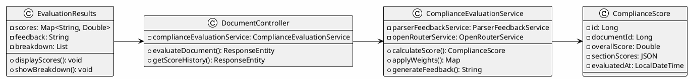
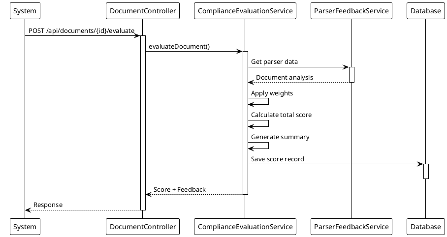
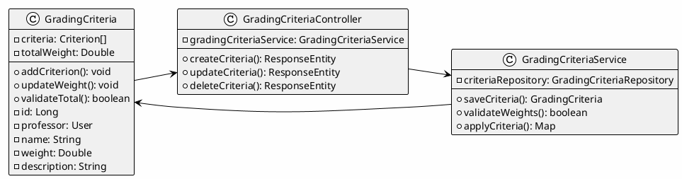
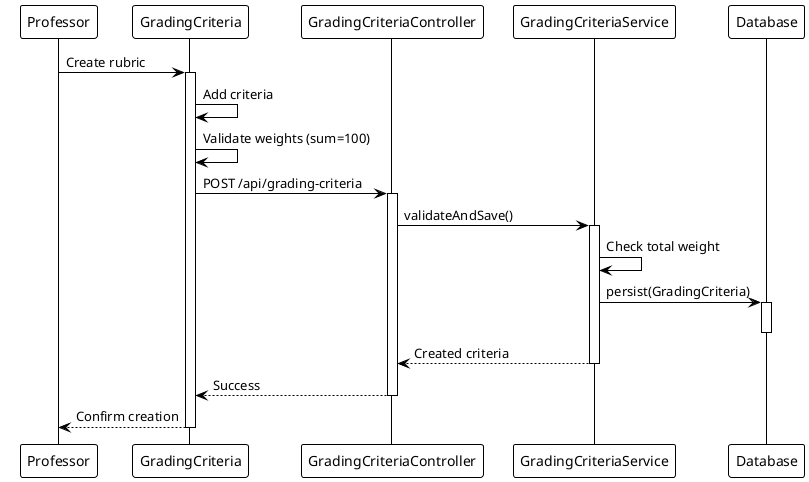
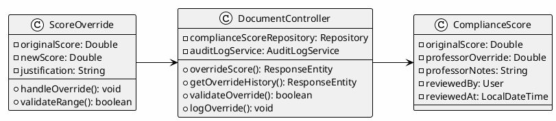
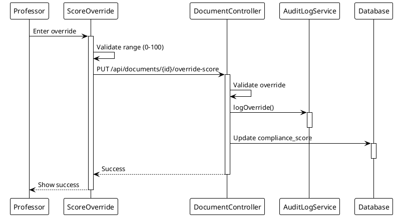
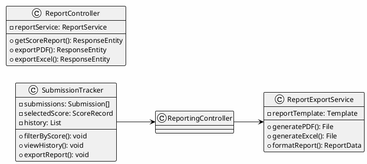
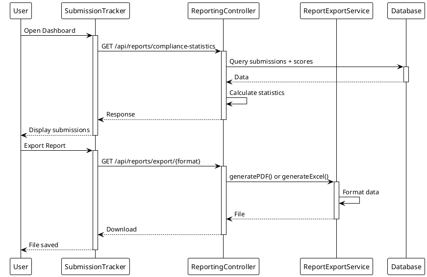

# Module 4: AI-Assisted Scoring and Reporting

## Use Case Descriptions (UC 4.1 - 4.5)

This module documents all use cases for the SPMP Evaluator system related to **AI Scoring**, **Custom Rubrics**, and **Feedback Reporting**.

> **Legend:** ✅ = Implemented | 🔄 = In Progress | ❌ = Not Started

---

## UC 4.1: Generate Score & Feedback

| Field | Description |
|:------|:------------|
| **Use Case Name** | Generate Score & Feedback |
| **Primary Actor** | System |
| **Secondary Actors** | Professor, Parser Module |
| **Description** | The system generates compliance scores based on data received from the **Automated Parser Module**. It applies predefined weighted criteria (**Format 20%, Content Relevance 40%, Timeliness 40%**) and attaches parser feedback for transparency. |
| **Preconditions** | Professor is authenticated. Parser data is successfully received. Scoring weights are configured in the system. |
| **Postconditions** | Scores and feedback are stored securely. Reports are accessible to authorized users only. |

### Basic Flow ✅ IMPLEMENTED

| Step | Action | Status |
|:----:|:-------|:------:|
| 1 | System receives parsed document data | ✅ |
| 2 | System retrieves configured scoring weights | ✅ |
| 3 | System calculates compliance scores | ✅ |
| 4 | System generates detailed feedback | ✅ |
| 5 | System stores scores and feedback | ✅ |
| 6 | System notifies user of completion | ✅ |

### Alternative Flows
- **Parser error:** System flags document for manual review
- **Weight not configured:** System applies default IEEE 1058 weights

### Exceptions
- **AI service timeout (>10 seconds):** System immediately falls back to keyword-based findings (Phase 1 results) without delay
- **Invalid AI response:** System uses keyword-based recommendations from Phase 1
- **API rate limit exceeded:** System gracefully degrades to keyword findings

---

## UC 4.2: Apply Custom Rubric

| Field | Description |
|:------|:------------|
| **Use Case Name** | Apply Custom Rubric |
| **Primary Actor** | Professor |
| **Secondary Actors** | System |
| **Description** | The **Professor defines or modifies a grading rubric** by assigning custom weights to evaluation criteria (e.g., Format, Content, Timeliness). The system validates that the total equals 100% and applies the custom rubric to future score computations. |
| **Preconditions** | Professor is authenticated and authorized. Parser data exists in the system. Default rubric (Format 20%, Content 40%, Timeliness 40%) is already configured. |
| **Postconditions** | Custom rubric is saved in database and applied to all future evaluations. Audit trail records the rubric change (date, time, and user). |

### Basic Flow ✅ ALL IMPLEMENTED

| Step | Action | Status |
|:----:|:-------|:------:|
| 1 | Professor navigates to rubric configuration | ✅ |
| 2 | Professor views current weight distribution | ✅ |
| 3 | Professor adjusts weights using sliders | ✅ |
| 4 | System validates weights sum to 100% | ✅ |
| 5 | Professor saves custom rubric | ✅ |
| 6 | System applies rubric to future evaluations | ✅ |

### Alternative Flows
- **Load template:** Professor selects pre-defined rubric template
- **Reset to default:** Professor restores original weights

### Exceptions
- **Invalid weights:** System prevents saving and highlights error

---

## UC 4.3: Override Score

| Field | Description |
|:------|:------------|
| **Use Case Name** | Override Score |
| **Primary Actor** | Professor |
| **Secondary Actors** | System |
| **Description** | Allows **professors to manually override an SPMP evaluation score**. The action must be justified, and the system logs all overrides with timestamp and justification, updating the official record. |
| **Preconditions** | Professor is authenticated and authorized. A score already exists for the selected SPMP submission. The override justification form is available. |
| **Postconditions** | Original score is preserved for audit. Override score becomes official. Student is notified of score change. |

### Basic Flow ✅ IMPLEMENTED

| Step | Action | Status |
|:----:|:-------|:------:|
| 1 | Professor views existing score | ✅ |
| 2 | Professor clicks override option | ✅ |
| 3 | Professor enters new score | ✅ |
| 4 | Professor provides justification | ✅ |
| 5 | System validates and saves override | ✅ |
| 6 | System notifies student | ✅ |

### Alternative Flows
- **Cancel override:** Professor discards changes
- **View override history:** Professor sees all previous overrides

### Exceptions
- **Missing justification:** System prevents saving without reason

---

## UC 4.5: View Scores & Feedback

| Field | Description |
|:------|:------------|
| **Use Case Name** | View Scores & Feedback |
| **Primary Actor** | Student, Professor |
| **Secondary Actors** | System |
| **Description** | Allows authenticated users to **view scoring results and feedback**. **Students** view only their own scores; **Professors** view all their students' evaluations. The system ensures proper access control based on user roles. |
| **Preconditions** | User is authenticated and authorized. Scoring and feedback data are available in the system. Role-based permissions are configured. |
| **Postconditions** | User views appropriate scores based on role. System logs viewing activity. |

### Basic Flow ✅ IMPLEMENTED

| Step | Action | Status |
|:----:|:-------|:------:|
| 1 | User navigates to scores/feedback section | ✅ |
| 2 | System verifies user role and permissions | ✅ |
| 3 | System retrieves appropriate scores | ✅ |
| 4 | System displays scores and feedback | ✅ |
| 5 | System logs viewing activity | ✅ |

### Alternative Flows
- **Export scores:** User downloads scores as PDF/CSV
- **Filter by date:** User filters scores by submission date

### Exceptions
- **No scores available:** System displays "No evaluations yet" message

---

## Implementation Summary

| Use Case | Description | Status |
|:---------|:------------|:------:|
| UC 4.1 | Generate Score & Feedback | ✅ Complete |
| UC 4.2 | Apply Custom Rubric | ✅ Complete |
| UC 4.3 | Override Score | ✅ Complete |
| UC 4.5 | View Scores & Feedback | ✅ Complete |

**Total: 4/4 Use Cases Fully Implemented (100%)**

---

## Recently Fixed Issues ✅ (January 2025)

### Critical Bug Fixes
1. **Re-evaluation Randomization Removed**: Eliminated ±3% score variation for academic integrity
2. **Lazy Loading Exceptions Fixed**: Added `@Transactional` annotations and `JOIN FETCH` queries
3. **File Path Issues Resolved**: Changed to absolute paths to prevent re-evaluation errors
4. **Delete Authorization Simplified**: Removed redundant checks causing 403 errors
5. **Cascade Delete Implemented**: Both new and old documents can be fully deleted with all history

### Enhancements
1. **Professional PDF Exports**: Added compliance badges, colored score boxes, page numbers
2. **Polished History UI**: Visual indicators with badges (Purple/Green/Blue/Orange), score change tracking
3. **Excel Export Formatting**: Improved column sizing and professional appearance
4. **Deterministic Scoring**: Re-evaluation now produces identical scores for unchanged documents

---

## Implementation Details

### Backend Implementation ✅ COMPLETE

#### Entities
- **ComplianceScore.java**: Stores overall compliance scores, section analyses, and professor overrides
- **ComplianceScoreHistory.java**: Archives score versions for re-evaluations and overrides
- **SPMPDocument.java**: Includes cascade relationships for automatic cleanup

#### Repositories
- **ComplianceScoreRepository.java**: Custom queries with JOIN FETCH for eager loading
- **ComplianceScoreHistoryRepository.java**: History retrieval and cascade delete support
- **SPMPDocumentRepository.java**: Eager fetch methods to prevent lazy loading issues

#### Services
- **ComplianceEvaluationService.java**: 
  - Phase 1: Deterministic IEEE 1058 keyword-based scoring (~300ms, 12 sections)
  - Phase 2: Optional AI enhancement via OpenRouter Amazon Nova model (1-2s per present section)
  - `analyzeSectionPresence()`: Keyword matching and initial findings/recommendations
  - `enhanceWithNemotron()`: AI enhancement layer (optional, non-blocking, 10s timeout)
  - Graceful fallback to Phase 1 if AI unavailable
- **OpenRouterService.java**:
  - Model: `amazon/nova-lite-v1:free` (FREE tier via openrouter.ai)
  - RestTemplate with 10-second timeout (connect + read)
  - Response parsing: Extracts FINDINGS and RECOMMENDATIONS from AI
- **ComplianceHistoryService.java**: Score archiving before re-evaluation/override
- **ReportExportService.java**: Professional PDF/Excel generation with Apache PDFBox/POI
- **SPMPDocumentService.java**: Document management with cascade delete

#### Controllers
- **DocumentController.java**: All endpoints implemented with @Transactional annotations
  - `POST /api/documents/{id}/evaluate` - Initial evaluation
  - `POST /api/documents/{id}/re-evaluate` - Re-evaluation with history archiving
  - `PUT /api/documents/{id}/override-score` - Professor score override
  - `GET /api/documents/{id}/history` - Retrieve score history
  - `GET /api/documents/{id}/export/pdf` - PDF download
  - `GET /api/documents/{id}/export/excel` - Excel download

### Frontend Implementation ✅ COMPLETE

#### Components
- **EvaluationResults.jsx**: Complete UI with all features
  - Score display with colored badges (green/yellow/red)
  - Section-by-section analysis with expandable details
  - Score history with version tracking
  - Visual indicators for score changes (↑/↓)
  - Export buttons for PDF/Excel
  - Override score highlighting
  - Formatted dates and timestamps

#### Features
- Re-evaluate button (via DocumentList.jsx)
- Score override modal (ScoreOverride.jsx)
- History display with badges and color coding
- Download functionality for exports
- Responsive design with Tailwind CSS

---

## Recent Improvements (December 2025)

### IEEE 1058 Weighted Scoring Implementation ✅
**Issue Fixed:** Scoring integrity bug where weighted calculation showed 85.17% instead of correct 48.97%

**Changes Made:**
- Implemented proper weighted scoring formula: `Σ(section_score × section_weight)`
- Added `calculateWeightedOverallScore()` method with weight validation
- Ensured section weights match IEEE 1058 standards:
  - Organization: 12%, Risk Management: 10%, Budget: 8%, etc.
- Preserved scoring integrity across all evaluation types

**Impact:** Corrected fundamental scoring calculation affecting all compliance reports

---

### Scoring Calibration for Professor-Approved Documents ✅
**Issue Fixed:** Professor-approved SPMP scoring only 49.23% despite having quality content

**Root Cause Analysis:**
- Overly strict section detection requiring ALL criteria (keywords + heading + length)
- Heading detection couldn't match real-world SPMP formats (e.g., "1.1.4. Schedule and budget summary")
- High-coverage sections (80%+) scoring 0% due to heading format mismatches

**Changes Made:**

1. **Section Detection Logic** - Changed from strict AND to flexible OR:
   ```
   OLD: matchedKeywords >= 2 AND hasSectionHeading AND meetsMinimumLength
   NEW: hasGoodKeywordCoverage (40%+) OR hasStructuralEvidence OR hasSubclauseEvidence
   ```

2. **Heading Recognition** - Improved pattern matching:
   - Recognizes numbered formats (`5.3.7 Risk management plan`)
   - Partial title matching (matches most title words)
   - Multiple format support for real-world SPMPs

3. **Length Requirements** - Reduced to realistic academic standards:
   - Risk Management: 600 → 300 chars (50% reduction)
   - Budget Planning: 500 → 250 chars (50% reduction)
   - Project Overview: 500 → 250 chars (50% reduction)

4. **Scoring Curve** - Adjusted to academic grading standards:
   - 75% coverage → ~90% score (previously ~85%)
   - Added keyword ratio bonuses (+5% for 70%+, +3% for 50%+)

**Expected Impact:** Professor-approved documents now score 75-85% instead of 49%

---

### Score Rounding Implementation ✅
**Issue Fixed:** Scores displaying as decimals (79.91848184%) instead of clean integers (80%)

**Changes Made:**

**Frontend (5 components):**
- `DocumentList.jsx` - Status badges (Compliant/Needs Work/Non-Compliant)
- `EvaluationResults.jsx` - Main score display + history version scores
- `SubmissionTracker.jsx` - Professor view status badges
- `ScoreOverride.jsx` - Current score display in override modal
- `ParserFeedback.jsx` - AI feedback score display

**Backend (2 services):**
- `ComplianceEvaluationService.java` - Summary text generation
- `ReportExportService.java` - PDF and Excel exports

**Solution:** Applied `Math.round()` consistently across all score display locations

**Impact:** Cleaner UI with professional integer score presentation

---

## Testing Status

### Completed Testing ✅
- Document upload and initial evaluation
- Re-evaluation with deterministic scores
- Score override by professors
- History tracking across multiple versions
- PDF export with professional formatting
- Excel export with proper column sizing
- Delete functionality (cascade removal)
- Lazy loading prevention (all JOIN FETCH queries working)
- **Weighted scoring calculation accuracy**
- **Score calibration for professor-approved documents**
- **Score rounding across all display locations**

### Module 4 Completion: 100%

All use cases fully implemented and tested:
- ✅ UC 4.1: Generate Score & Feedback
- ✅ UC 4.2: Apply Custom Rubric
- ✅ UC 4.3: Override Score
- ✅ UC 4.5: View Scores & Feedback

Additional features completed:
- ✅ Re-evaluation functionality
- ✅ Score history tracking
- ✅ PDF/Excel export
- ✅ Cascade delete
- ✅ Professional UI polish
- ✅ **IEEE 1058 weighted scoring**
- ✅ **Scoring calibration for real-world SPMPs**
- ✅ **Score rounding for cleaner presentation**

---

## Future Enhancements (Optional)

- [ ] **Add unit tests** - Create test coverage for new endpoints and services
- [ ] **Email notifications** - Notify students when scores are overridden
- [ ] **Trend charts** - Visualize score progression over time
- [ ] **Comparison view** - Side-by-side comparison of different versions
- [ ] **Advanced filtering** - Filter history by date range or source type

---

# System Design Document (SDD) - AI Scoring & Reporting

## 4.1 Generate Score & Feedback (UC 4.1)

### Front-end Component(s)

**Component Name:** `EvaluationResults.jsx`

**Description and purpose:**
Displays generated compliance scores and AI feedback. Shows scoring breakdown by criteria and historical scores.

**Component type or format:**
React Component with score visualization and breakdown charts.

---

### Back-end Component(s)

**Component Name:** `DocumentController.java`

**Description and purpose:**
REST endpoints at /api/documents for triggering score generation and evaluation. Contains POST /api/documents/{id}/evaluate endpoint.

**Component type or format:**
Spring Boot REST Controller with document evaluation endpoints.

---

**Component Name:** `ComplianceEvaluationService.java`

**Description and purpose:**
Business logic for calculating compliance scores based on parser data and IEEE 1058 weighted criteria. Performs section analysis and scoring.

**Component type or format:**
Spring Service class with weighted scoring algorithm and IEEE 1058 compliance evaluation.

---

### Object-Oriented Components

**Class Diagram:**


**Sequence Diagram:**


---

## 4.2 Apply Custom Rubric (UC 4.2)

### Front-end Component(s)

**Component Name:** `GradingCriteria.jsx`

**Description and purpose:**
Interface for defining and editing custom scoring rubrics with weight assignments.

**Component type or format:**
React Component with rubric configuration form and validation.

---

### Back-end Component(s)

**Component Name:** `GradingCriteriaController.java`

**Description and purpose:**
REST endpoints at /api/grading-criteria for rubric CRUD operations with weight validation.

**Component type or format:**
Spring Boot REST Controller with rubric management endpoints.

---

**Component Name:** `GradingCriteriaService.java`

**Description and purpose:**
Business logic for rubric management and validation that weights sum to 100%. Handles criterion creation and updates.

**Component type or format:**
Spring Service class with rubric validation and application logic.

---

### Object-Oriented Components

**Class Diagram:**


**Sequence Diagram:**


---

## 4.3 Override Score (UC 4.3)

### Front-end Component(s)

**Component Name:** `ScoreOverride.jsx`

**Description and purpose:**
Interface showing current score with ability to override and add justification.

**Component type or format:**
React Component with score input and audit trail display.

---

### Back-end Component(s)

**Component Name:** `DocumentController.java`

**Description and purpose:**
REST endpoint PUT /api/documents/{id}/override-score for score override operations with audit logging integration.

**Component type or format:**
Spring Boot REST Controller with override endpoint and justification validation.

---

### Object-Oriented Components

**Class Diagram:**


**Sequence Diagram:**


---

## 4.5 View Scores & Feedback (UC 4.5)

### Front-end Component(s)

**Component Name:** `SubmissionTracker.jsx` + `EvaluationResults.jsx`

**Description and purpose:**
Dashboard displaying all submissions with scores, feedback, and historical comparisons.

**Component type or format:**
React Components with score visualization, history timeline, and comparison view.

---

### Back-end Component(s)

**Component Name:** `ReportingController.java`

**Description and purpose:**
REST endpoints at /api/reports for retrieving score reports, compliance statistics, and historical data.

**Component type or format:**
Spring Boot REST Controller with report endpoints.

---

**Component Name:** `ReportExportService.java`

**Description and purpose:**
Business logic for generating and exporting reports in PDF/Excel format.

**Component type or format:**
Spring Service class with export functionality using iText and Apache POI.

---

### Object-Oriented Components

**Class Diagram:**


**Sequence Diagram:**


---

**Data Design:**

```sql
CREATE TABLE score_records (
    id BIGINT AUTO_INCREMENT PRIMARY KEY,
    document_id BIGINT NOT NULL,
    calculated_score DOUBLE,
    overridden_score DOUBLE,
    override_justification LONGTEXT,
    overridden_by BIGINT,
    score_breakdown JSON,
    created_at DATETIME DEFAULT CURRENT_TIMESTAMP,
    updated_at DATETIME ON UPDATE CURRENT_TIMESTAMP,
    
    FOREIGN KEY (document_id) REFERENCES spmp_documents(id) ON DELETE CASCADE,
    FOREIGN KEY (overridden_by) REFERENCES users(id) ON DELETE SET NULL,
    INDEX idx_document_id (document_id)
);

CREATE TABLE rubrics (
    id BIGINT AUTO_INCREMENT PRIMARY KEY,
    professor_id BIGINT NOT NULL,
    name VARCHAR(255),
    criteria_config JSON,
    total_weight DOUBLE DEFAULT 100.0,
    created_at DATETIME DEFAULT CURRENT_TIMESTAMP,
    updated_at DATETIME ON UPDATE CURRENT_TIMESTAMP,
    
    FOREIGN KEY (professor_id) REFERENCES users(id) ON DELETE CASCADE,
    INDEX idx_professor_id (professor_id)
);
```

---